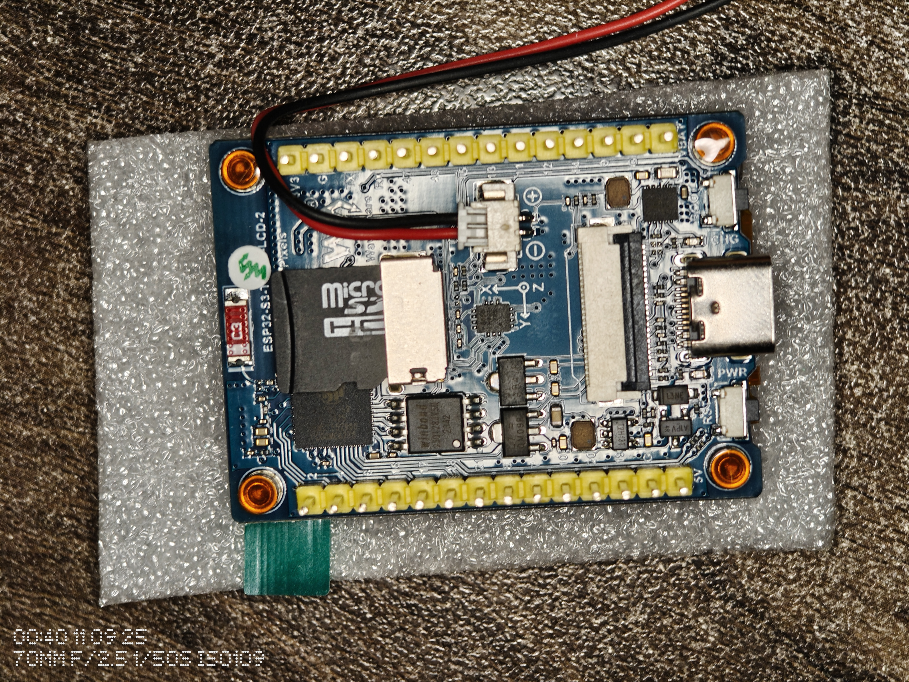

#### A quick backstory
So QED42, my previous company is hosting an AI conference soon in last week of November 2025, and hey I just thought it would be really cool if I can the event logo animated on a badge that I will put inside the lanyard. So I first got the video animated using Google Veo 3.1 on Weavy.ai which Figma recently acquired.

Since I was a bit cash tight I had to think of a very cheap and way way to do this. Randomly explored my regular site Robu.in and found that a lot of ESP32 boards came with LCD displays, that too as small as 1.3 inches to 2.4 inches. I thought why not use one of those boards to display the video. After filtering based on cost and an ideal size and features I finally settled on the Waveshare ESP32-S3-LCD-2 board which costed me around 1.5K INR or 17 USD at the time of purchase. (Nov 2025)

Spoiler: It's pretty easy to hack around and awesome to just look at.

#### The Hardware: ESP32-S3-LCD-2

The board I'm working with is the ESP32-S3-LCD-2, which is basically an all-in-one solution for display projects. Here's what makes it interesting:

- **ESP32-S3R8 chip**: Dual-core Xtensa LX7 @ 240MHz
- **Memory**: 512KB SRAM + 8MB PSRAM (this PSRAM is crucial for video buffering)
- **Display**: 2" ST7789T3 LCD with 240×320 resolution
- **IMU**: QMI8658 6-axis sensor (accelerometer + gyroscope)
- **Storage**: 16MB Flash memory + SD Card Slot
- **Connectivity**: USB-C for programming and power
- **Buttons**: BOOT button (GPIO 0) for user input
- **Battery**:  3.7V lithium battery charge/discharge JST 1.25mm header



What's great about this board is that everything is already wired up. No breadboard maze, no jumper wires, no wondering if you got the SPI pins right. Just plug it in and start coding.

Read more about the board here: 
- [Waveshare ESP32-S3-LCD-2 Wiki](https://www.waveshare.com/wiki/ESP32-S3-LCD-2)
- [Robu.in Product Listing for the same](https://robu.in/product/waveshare-esp32-s3-2inch-display-development-board-240x320-pixels-32-bit-lx7-dual-core-processor-esp32-with-display/)

#### The Idea: A Self-Contained Video Player

I wanted to build something that could:

1. Play a video file in an infinite loop
2. Store the video in flash memory (no SD card, because I had trouble with getting older SD card up and running, it was too much hacky work for a simple project)
3. Automatically rotate the display based on device orientation
4. Respond to button presses (pause/play, power management)
5. And finally run smoothly without stuttering!

Think of it like a digital photo frame, but cooler because it's a video badge that knows which way is up. Hehe

#### Video Format: Why MJPEG?

First question: What video format should we use? The options aren't great for microcontrollers:

- **H.264/MP4**: Too complex, requires dedicated hardware decoder
- **Raw RGB frames**: 240 × 320 × 2 bytes × 30fps = Way too much data
- **GIF**: Limited colors, larger files than you'd expect
- **MJPEG**: Just a series of JPEG images back-to-back

MJPEG (Motion JPEG) turned out to be perfect for this use case. It's essentially just JPEG images played one after another, which means:

- We can decode one frame at a time (low memory overhead)
- JPEG compression is efficient (~90% size reduction)
- No complex inter-frame dependencies
- Easy to seek and loop

The tradeoff is file size compared to modern codecs like H.264, but for a 3-second loop stored in flash? MJPEG is ideal.

#### Converting Video with FFmpeg

Getting video into MJPEG format is straightforward with FFmpeg. Here's what I'm doing:

```bash
ffmpeg -i input.mp4 -vf "scale=320:240" -q:v 15 -r 10 output.mjpeg
```

Let's break this down:

- **-i input.mp4**: Input video file
- **-vf "scale=320:240"**: Resize to 320×240 to match the display resolution
- **-q:v 15**: JPEG quality (2-31 scale, lower is better quality, 15 is a good balance)
- **-r 10**: Frame rate of 10 frames per second (smooth enough while keeping file size manageable)
- **output.mjpeg**: Output file in MJPEG format

The result is a 1.2MB file for about 3 seconds of video. Small enough to fit comfortably in flash with room to spare.

#### The Architecture: How It All Fits Together

Here's the high-level flow:

```
       │ Upload to Flash first
       ▼
┌─────────────┐
│ Flash (16MB)│
│ output.mjpeg│
└──────┬──────┘
       │ Load into PSRAM at startup
       ▼
┌─────────────┐
│ PSRAM (8MB) │
│ Video Buffer│
└──────┬──────┘
       │ Stream frames
       ▼
┌─────────────┐      ┌──────────────┐
│ MJPEG Parser├─────►│ JPEG Decoder │
└─────────────┘      └──────┬───────┘
                            │ Render
                            ▼
                     ┌──────────────┐
                     │ ST7789 LCD   │
                     └──────────────┘

┌─────────────┐      ┌──────────────────┐
│ QMI8658 IMU ├─────►│ Orientation Mgr  │──► Auto-rotate
└─────────────┘      └──────────────────┘

┌─────────────┐      ┌──────────────────┐
│ BOOT Button ├─────►│ Button Handler   │──► Pause/Power
└─────────────┘      └──────────────────┘
```

The key insight: Load the entire video into PSRAM (external RAM) at startup, then stream from there. PSRAM is slower than internal SRAM, but it's perfect for bulk storage like this.

#### Memory Strategy: PSRAM vs SRAM

The ESP32-S3 has two types of memory:

- **SRAM (512KB)**: Fast, but limited
- **PSRAM (8MB)**: Slower, but abundant

Here's how I'm using them:

```cpp
// Load entire video into PSRAM (external RAM)
size_t fileSize = videoFile.size();
videoBuf = (uint8_t*)ps_malloc(fileSize);  // ps_malloc = PSRAM allocation
videoFile.read(videoBuf, fileSize);

// Decode buffer in SRAM (faster for active processing)
decodeBuf = (uint8_t*)malloc(320 * 240 / 2);  // malloc = SRAM allocation
```

**Why this works:**
- Video buffer (1.2MB) → PSRAM (plenty of space)
- Decode buffer (38KB) → SRAM (speed matters here)
- Working memory → SRAM (everything else)

#### The MemoryStream Class: Streaming from PSRAM

To make the video loop infinitely, I created a simple `MemoryStream` class that implements Arduino's `Stream` interface:

```cpp
class MemoryStream : public Stream {
  uint8_t *buf;
  size_t sz, pos;
public:
  MemoryStream(uint8_t *b, size_t s) : buf(b), sz(s), pos(0) {}

  int available() override { return sz - pos; }

  int read() override {
    return (pos < sz) ? buf[pos++] : -1;
  }

  void reset() { pos = 0; }  // Loop back to start!

  // ... other Stream interface methods
};
```

This lets us treat the PSRAM buffer as if it were a file. When we reach the end, just call `reset()` and start over. Simple and effective.

#### Parsing MJPEG: Finding Frame Boundaries

MJPEG is just a sequence of JPEG images concatenated together. Each JPEG image starts with the marker `FF D8` (Start of Image) and ends with `FF D9` (End of Image).

The parser's job is to:
1. Scan through the stream looking for `FF D8`
2. Copy bytes into a buffer until we find `FF D9`
3. Pass that buffer to the JPEG decoder
4. Repeat for the next frame

Here's the essence of the frame extraction logic:

```cpp
bool readMjpegBuf() {
  // Find Start of Image marker (FF D8)
  while (buf_read > 0 && !found_FFD8) {
    if (read_buf[i] == 0xFF && read_buf[i + 1] == 0xD8) {
      found_FFD8 = true;
    }
    i++;
  }

  // Copy data until End of Image marker (FF D9)
  while (buf_read > 0 && !found_FFD9) {
    if (p[i] == 0xFF && p[i + 1] == 0xD9) {
      found_FFD9 = true;
    }
    memcpy(mjpeg_buf + offset, p, i);
    offset += i;
    // Continue reading...
  }

  return found_FFD9;  // Frame complete!
}
```

Once we have a complete frame, we hand it off to the JPEGDEC library which handles the decompression and renders directly to the display.

#### Gyro-Based Auto-Rotation: The Fun Part

The board has a QMI8658 IMU with both accelerometer and gyroscope. For orientation detection, we only need the accelerometer - specifically the Y-axis reading.

When the device is held normally (USB port on the right), gravity pulls down, giving us a positive Y acceleration. Rotate it sideways 180° (USB port on the left), and the Y reading becomes negative.

But there's a problem: Sensors are noisy. If we just check the raw accelerometer value, the screen would flicker constantly as tiny vibrations cross the threshold.

#### Debouncing with Hysteresis

The solution is a two-part strategy:

**1. Hysteresis** - Create a "dead zone" around zero:

```cpp
const float THRESHOLD = 0.5;  // ±0.5g dead zone

if (accelY > THRESHOLD) {
  desiredRotation = 1;  // USB on right
} else if (accelY < -THRESHOLD) {
  desiredRotation = 3;  // USB on left (180° flip)
} else {
  desiredRotation = currentRotation;  // Stay put!
}
```


Its a phenomenon where the output of a system depends on its past history, causing a "lag" between an input and its output. This means the system's current state depends not only on its present input but also on what has happened before. Examples include you very phone that doesn't keep glitching whenever you rotate it a bit, but instead waits for a moment before changing the orientation to confirm that you movement are within a certain threshold or range.


**2. Debouncing** - Require 1 second of stability before committing:

```cpp
const unsigned long DEBOUNCE_MS = 1000;

if (desiredRotation != currentRotation) {
  if (pendingRotation == desiredRotation) {
    // Same desired rotation, check if enough time has passed
    if (millis() - debounceStartTime >= DEBOUNCE_MS) {
      currentRotation = desiredRotation;  // Commit the change
    }
  } else {
    // Different desired rotation, restart the timer
    pendingRotation = desiredRotation;
    debounceStartTime = millis();
  }
}
```

This means you have to hold the device in the new orientation for a full second before it rotates. It sounds like a long time, but in practice it feels natural - you flip the device, and a moment later the screen updates. No jitter, no accidental rotations. Ah also since the video I played had some flowing liquid elements and a circle logo thing the other half, it rarely ever felt like it rotated, it just always felt as part of the video.

#### The OrientationManager Class

I packaged all this logic into an `OrientationManager` class:

```cpp
class OrientationManager {
  const float THRESHOLD = 0.5;
  const unsigned long DEBOUNCE_MS = 1000;
  const unsigned long POLL_INTERVAL_MS = 50;  // 20Hz polling

  uint8_t currentRotation;
  uint8_t pendingRotation;
  unsigned long debounceStartTime;
  bool rotationJustChanged;

public:
  void update() {
    // Poll sensor at 20Hz
    if (millis() - lastPollTime < POLL_INTERVAL_MS) return;

    // Read accelerometer
    IMU.update();
    IMU.getAccel(&accelData);

    // Apply hysteresis and debouncing logic
    // ...
  }

  uint8_t getRotation() { return currentRotation; }

  bool hasChanged() {
    if (rotationJustChanged) {
      rotationJustChanged = false;  // One-shot flag
      return true;
    }
    return false;
  }
};
```

The `hasChanged()` method returns `true` exactly once when a rotation occurs, making it easy to react to orientation changes without continuously updating the display.

#### Button Controls: Pause and Power

The board has a BOOT button (GPIO 0) that we can repurpose for user interaction. Using the OneButton library, I set up two actions:

- **Single click**: Toggle pause/play
- **Long press**: Toggle power (blank screen + backlight off)

```cpp
OneButton button(BTN_BOOT, true);

void onButtonClick() {
  player.togglePause();
}

void onButtonLongPressStart() {
  player.togglePower();
}

void setup() {
  button.attachClick(onButtonClick);
  button.attachLongPressStart(onButtonLongPressStart);
}

void loop() {
  button.tick();  // Process button events
  // ...
}
```

The power-off feature is especially useful for battery-powered scenarios. Long-press the button, and the screen goes blank with the backlight off, saving significant power while keeping the device technically running. (I do intent to expand this to actual deep sleep mode and auto timer based sleep as well for future iterations)

#### The Main Loop: Putting It All Together

After all that setup, the main loop is surprisingly simple:

```cpp
void loop() {
  // Check for orientation changes (20Hz polling internally)
  orientationMgr.update();

  // If orientation changed, update display rotation
  if (orientationMgr.hasChanged()) {
    player.setRotation(orientationMgr.getRotation());
  }

  // Handle button events
  button.tick();

  // Decode and display next frame (if not paused/powered off)
  player.play();
}
```

That's it. No complex state management, no threading, no interrupts. Just:
1. Check the gyro
2. Check the button
3. Play the next frame
4. Repeat

#### Uploading to Flash: The upload_to_flash.sh Script

Getting the MJPEG file onto the ESP32's flash memory requires a few steps:

1. Create a FAT filesystem image with the video file
2. Flash that image to the FFat partition

I automated this with a bash script:

```bash
#!/bin/bash
# Find mkfatfs tool
MKFATFS=$(find ~/.arduino15/packages/esp32/tools/mkfatfs -name "mkfatfs" | head -1)

# Create filesystem image from data/ folder
# 10354688 bytes = ~9.87 MB (the size of the FFat partition defined in partition table)
$MKFATFS -c data -t fatfs -s 10354688 ffat.bin

# Find esptool
ESPTOOL=$(which esptool.py || find ~/.arduino15/packages/esp32/tools -name "esptool.py" | head -1)

# Flash to partition at offset 0x611000
# 0x611000 is the start address of the FFat partition (defined in partition table)
# --baud 460800 sets the upload speed (460800 bits/sec for faster flashing)
python3 $ESPTOOL --chip esp32s3 --port /dev/ttyUSB0 --baud 460800 \
  write_flash 0x611000 ffat.bin
```

Just drop your `output.mjpeg` file in the `data/` folder and run the script. The FFat partition mounts automatically on boot, and the video is ready to play.


You can find my experiments here https://github.com/AJV009/esp32-s3-lcd-2-badge/tree/main/workbench/working_protos/00_video_loop_btn_pause_gyro_rotate <br> Do note that its just experiments at the moment, this repo will eventually grow as my updated plan for the badge is something very different. This is just 1 of around 5-6 blogs in this series alone.



I got all the code generated with Claude Code, am not a C/C++ expert, I can read it and assume thing based on my previous learnings from college time and also have played with Rust some time back. So I understand the code might have been a bit overwhelming, but trust me once you get the hang of it, it's pretty straightforward. The key is breaking down the problem into manageable pieces: video format, memory management, input handling, and display rendering. And often AI would help with that, but in worst case if that fails, reading datasheets and library docs always helps. Just feed in these collected info to AI and it can help you generate code snippets that work in a single shot with minimal edits.
