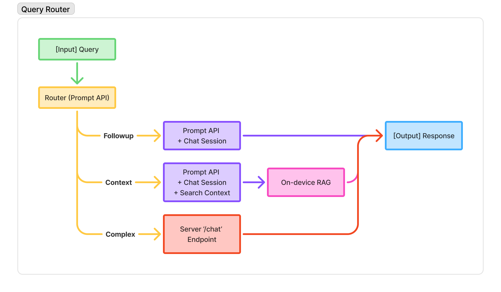
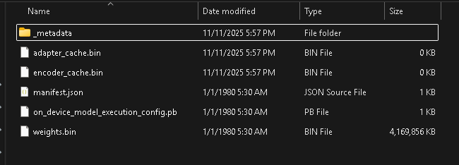
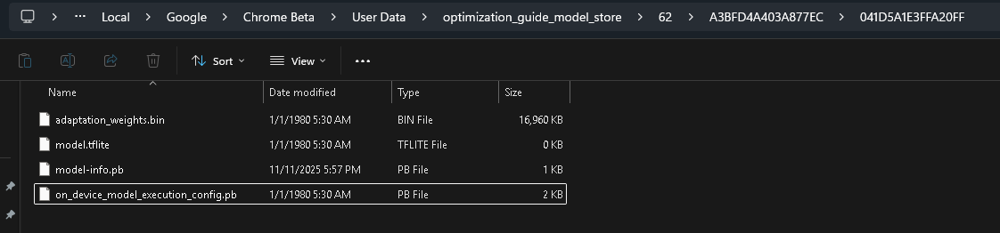
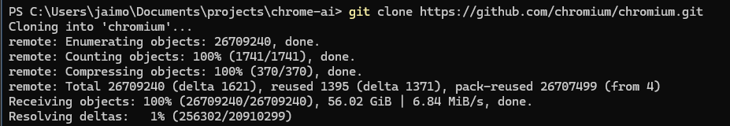

The web as we know today is undergoing quiet some changes. Finally websites can utilize on-device AI capabilities **without downloading GBs of there own model**, yes and guess what Google Chrome Devs are pushing for it. They have promosed around 6-7 APIs that utilize the underlying AI capable hardware to run AI experiences and expose some essential tools for make interesting experiences **without having to worry about the cost for simple practical use cases**. No servers, no API keys, no data leaving your machine.

In this post, I'll show you how I built a hybrid RAG (Retrieval-Augmented Generation) chatbot that routes queries between Chrome's local Prompt API and a FastAPI RAG backend Server. A system that knows when to handle queries locally on-device versus when to reach out to more powerful cloud models.

Before we do any deeper dives into the code or demo, you should know a bit about the Chrome AI history just for the sake of it.

## From Experiment to Web Standard

Google's journey to bring AI directly into the browser began publicly at **Google I/O 2024** in May, where they announced plans to integrate Gemini Nano, their efficient, on-device language model-directly into Chrome. The vision was to enable web developers to build AI-powered experiences without managing infrastructure, deploying models, or worrying about API costs.

By August 2024, Chrome launched several APIs into **origin trials**, opening up experimental access to developers worldwide. The [Early Preview Program](https://developer.chrome.com/docs/ai/built-in) quickly attracted over 13,000 developers eager to explore this new API layer soon to be web standards. (Me and my team back in QED42 were part of the EAP as well, we explored occasionally but didn't dive deep as its still something being slowly accepted and adopted by MDN and the web folks)

The momentum continued through 2024 and into 2025. **Chrome 138**, released in early 2025, marked a major milestone by bringing the Summarizer API, Language Detector API, Translator API, and Prompt API for Chrome Extensions into **stable release**. At **Google I/O 2025** in May, Google expanded the offerings further with the Writer, Proofreader and Rewriter APIs entering origin trials, and unveiled multimodal capabilities for the Prompt API in Chrome Canary.

### The Push for Web Standards

Chrome isn't building these APIs in isolation. Google has actively engaged with web standards bodies to make on-device AI a cross-browser reality. The APIs have been proposed to the [W3C Web Incubator Community Group](https://www.w3.org/community/wicg/), with several-including the Language Detector, Translator, Summarizer, Writer, and Rewriter APIs-already adopted by the W3C WebML Working Group.

Chrome has formally requested feedback from Mozilla (Firefox) and WebKit (Safari) through their respective standards positions processes. While explicit responses from other browser vendors are still pending, the standardization effort signals Chrome's intent to make this a web-wide capability, not a proprietary feature.

For the latest updates and official documentation, visit:
- [Chrome Built-in AI Homepage](https://developer.chrome.com/docs/ai/built-in)
- [Google Chrome Built-in AI Challenge 2025](https://googlechromeai2025.devpost.com/) You can find around ~1300 projects made by the community for this Challenge.
- [Chrome AI Updates from Google I/O 2025](https://developer.chrome.com/blog/web-at-io25)

## The Built-in AI API Landscape

Chrome's AI capabilities span seven distinct APIs, each optimized for specific tasks:

1. **Prompt API** (Origin Trial / Stable in Extensions)
The most flexible of the bunch, a general-purpose interface to Gemini Nano for natural language tasks. Supports text, image, and audio inputs (multimodal in Canary). Perfect for classification, Q&A, content analysis, and any custom AI workflow. Some use cases are: Chatbots, content classification, semantic search, custom workflows and Query Routers.

2. **Summarizer API** (Stable in Chrome 138+)
Generates summaries in various formats: single sentences, paragraphs, bullet lists, or custom lengths. Ideal for condensing long articles, meeting transcripts, or user-generated content. Some use cases are: Article TL;DR, meeting notes and forum post summaries.

3. **Writer API** (Origin Trial)
Creates new content based on specified writing tasks and optional context. Can draft emails, reviews, blog posts, or any text from scratch. Some use cases are: Email drafting, content generation and writing assistance.

4. **Rewriter API** (Origin Trial)
Refines existing text by adjusting length or tone. Make content more formal, casual, concise, or elaborate. Some use cases are: Tone adjustment, text polishing and feedback improvement.

5. **Proofreader API** (Chrome Canary)
Grammar and style corrections for polished writing. Some use cases are: Writing quality checks and error detection.

6. **Translator API** (Stable in Chrome 138+)
Local language translation using expert models (not Gemini Nano). Some use cases are: Multi-language support and accessibility.

7. **Language Detector API** (Stable in Chrome 138+)
Identifies the language of text input. Some use cases are: Auto-detection for translation and content routing.

Each API is task-specific and optimized for its domain. But here's the thing: **the Prompt API stands apart.**


#### Prompt API for custom Prompting a Simple Query Router
The flexibility of the Prompt API makes it perfect for **contextual query routing** a use case that's both practical and underutilized. Instead of blindly sending every query to an expensive cloud API or handling everything with a constrained on-device model, you can create a **hybrid system** that:

1. Uses Prompt API to **classify the query** (simple vs. complex)
2. Routes simple queries to **on-device processing** (fast, free, private)
3. Routes complex queries to **powerful cloud models** (when needed)

This is the architectural pattern we'll explore in depth.

Before diving into the implementation, let's look at the data: **why does routing matter?**

#### The Economics of Query Routing

Recent research reveals that query routing isn't just a nice-to-have-it's transformational for cost, performance, and user experience. Here's what the data shows:

| Implementation | Cost Reduction | Source |
|---------------|----------------|---------|
| Routers with confidence-based escalation | **70%+** reduction | [IBM Research](https://research.ibm.com/blog/LLM-routers) |
| Small-to-large model routing | **50-85%** reduction | [Arcee AI](https://www.arcee.ai/blog/ai-model-routing-for-maximum-savings) |
| RouteLLM (GPT-4 → Mixtral routing) | **50%** reduction while maintaining 95%+ quality | [RouteLLM](https://github.com/lm-sys/RouteLLM) |
| Selective model routing on MT Bench | **75%** reduction vs. random baseline | [Anyscale](https://www.anyscale.com/blog/building-an-llm-router-for-high-quality-and-cost-effective-responses) |

#### Query Complexity Distribution

Not all queries are created equal. In real-world conversational AI deployments, **the vast majority of queries are simple**-and perfect candidates for on-device routing.

| Query Type | % of Total | Complexity | Ideal Route |
|-----------|-----------|------------|-------------|
| Greetings & pleasantries | **15-20%** | Trivial | On-device (Prompt API) |
| Simple follow-ups | **25-30%** | Low | On-device (Prompt API) |
| FAQ-style questions | **30-35%** | Low-Medium | On-device with context |
| Analytical queries | **10-15%** | High | Cloud API |
| Multi-step reasoning | **5-10%** | Very High | Cloud API |

What you see right there is a massive more than 50-60% of cost reduction if implemented right.

### Why This Matters for Our little Medical RAG

Applied to our medical knowledge chatbot:

1. **Follow-up queries** ("Can you elaborate?") → ~30% of interactions → 100% on-device
2. **Simple context queries** ("What is the heart?") → ~40% of interactions → On-device with local RAG
3. **Complex queries** ("Compare complications...") → ~30% of interactions → Cloud API

**Expected outcome:** ~70% of queries handled on-device, **saving 70%+ on API costs** while improving latency and privacy.

## The Idea: A Hybrid RAG Chat Router

Traditional RAG systems are all-or-nothing: every query goes through the same pipeline-vector search, context injection, LLM generation. But not all queries need the full treatment.

Consider these questions to a medical knowledge chatbot:

- **"What is the heart?"** → Needs context from the knowledge base, but straightforward
- **"Can you elaborate on that?"** → Just needs conversation history, no retrieval
- **"How do complications of diabetes interact with hypertension in elderly patients?"** → Complex, needs deep retrieval and powerful reasoning

So therefore comes the **Three-Tier Routing Strategy**

I designed a little system that classifies user queries into three categories and routes them accordingly:



## Implementation Deep Dive

Am not gonna document the whole backend code, its a simpel RAG not that fancy or anything, in fact its too basic. but you can visit [(Github) Chrome AI Demo](https://github.com/AJV009/chrome_ai_demo)



The whole demo was vibe coded sort of. I barely touched the code. (I did make some minor changes in structure and decisions that Claude made which I did not include in there)

Following is the prompt for the Python FastAPI:

```markdown
So here I have done a uv init, its an empty project at the moment BUT I want you to you an API for the following:

Its a very simple RAG API, by simple I mean no unnecessary error handlers and such, very simple, I need to use the code for a demo blog thing so no complications as such.

In fact the RAG background should be just copied from this notebook here, its another utter simple RAG here @/home/alphons/project/OAISYS25/chrome_ai_demo/workbench/rag_synth.ipynb its just a reference to show how simple it could be.

for the vector database use something simple as faiss BUT see that a file or some bin or some dumb is created locally AFTER all the documents are indexed into it because I don't want to re-index everything just because I restart the app, okay?

Now for the embedding model it would be a sentence transformer model but please for gods sake try NOT to download any nvidia libraries and stuff that comes as dependencies, they take GBs and endless times to download.
I guess its something like installing just the cpu versoin of torch first and then later installing sentence transfer and also setting device as cpu
`pip install torch --index-url https://download.pytorch.org/whl/cpu` (adapt to uv command as needed)


as for the model lets try this one: https://huggingface.co/sentence-transformers/embeddinggemma-300m-medical its a medical finetune of embeddinggemma-0.3b, its a new model and its around 1.3/4gb or so, YEs it will be slow on CPU but its okay, we are just creating a demo a>


Next is the chunking method, use a basic paragraph based chunking, no libraries needed as such, lets just do it manually detecting new lines and all.

A quick note on chunking:
When storing to the vector database create ids like this: doc_id_1_chunk_id_1, doc_id_1_chunk_id_2, doc_id_2_chunk_id_1, doc_id_2_chunk_id_2
Hope you got that pattern I'll tell you why we need that in a moment soon as I explain the RAG endpoints.

And as for the data set lets use https://huggingface.co/datasets/zxvix/MedicalTextbook its a data with text column filled with rows of TEXT about basic things. Don;t index complete database, just first 10 rows are enough.

And for inferencing we will use the same OpenRoute model and the way we are accessing it through openai library as seen in the previous notebook that I attached to you.

Now finally we will have 2 very important endpoints as following coming out of this FastAPI implementation:

"/search"
This is basically your vector search sort of thing.
Text in :: chunks out

"/chat"
this is your basic RAG chat thing, but the structure of this will be almost similar to OpenAI endpoints. WE WILL NOT store any history in the API instead we already sent an array of message as we usually do for such chatbots.
messages: [
    {
        "role": "system",
        "content": "some_content"
    },
    {
        "role": "user",
        "content": "tell me about xyz"
    },
    {
        "role": "assistant",
        "content": "xyz means abc and so on"
        "chunks_referred": [
            {
                "id": "doc_id_3_chunk_id_4",
                "content": "long text"
            },
            {
                "id": "doc_id_2_chunk_id_5",
                "content": "long text"
            }
        ]
    },
    {
        "role": "user",
        "content": "Oh thanks, that sounds nice"
    },
]

Now you might think how will the rag work in this case, so we pick the last element of the message array thats sent in, in this case the "oh thanks ..." and then do a quick retrivial on my function powering the search endpoint.

then pass it to the our openrouter api thing. note that since open sourte wont support custom params like "chunks_referred" don't send that into the openrouter api

The response need not be a streaming one for now. Since these are small models we will get the requires response quick so no worries there as well.

And a few more things to keep in mind:
- No need to write data models and stuff for the API, like I said this is a quick learning demo app.
- BUT yeah keep the logic code and stuff out of the routes file, every major action / function should be kept in a seperate like how folks structure large projects, even tho this is not large keeping each file line of code to less than 100 lines would be much cleaner and >

I move all the uv init files to @api folder, we will use that folder from now on.

Now ultrathink, and first propose me a plan before coding anything.
```

Next is the Prompt for the site:

```markdown
Now next we need to create a very simple html + js + css site.
It would be a static site, no complex js frameworks OR anything.
we will create this in the empty @web folder here

Add a simple multi turn chat UI, no need for session managing and services and so on.

Keep the JS part dedicated into its own js file, I mean speccifically the inference one and well make it talk with the python api that we just created.

btw keep the UI too very simple, like a multi-turn chat window in the middle, thats pretty much it.
```

And finally integrating the Chrome AI - Prompt API into it:

```markdown
Now we need to implement the Chrome API.
SO right now in this system I don't have access to WebGPU and therefore it wont work here but once you write the code I can test it on my secondary system which I previously already tested the demo sites of this new Chrome API.

So this is a very new API thing that Chrome is pushing for as web standards, so I need you to first do a bit of web search and study about Chrome in-built / on-device AI APIs.

We will be focusing specifically on the Prompt API here for our use case.
And here are some PDF copies of the documentations if you need:
1. @"workbench/developer.chrome.com-Get started with built-in AI.pdf"
2. @"workbench/developer.chrome.com-The Prompt API.pdf"
(Also my origin trials token can be found in ".origin_trail_token" in the workbench folder)

Now I will get down to our use case and idea properly here:
Am planning to use this like a prompt router / gateway sort of thing.

1. So when the user inputs there message in the chatbot (the chatbot can be found in the @web folder, as you can already see we have tried to keep all the code very slim, and simple as this is a demo app)

2. We will have a seperate few-shot array of message for the "query_router".
The query_router thing will sort of classify the prompts into following buckets based on there types:

2.1 Follow up queries: "Oh, can you elaborate please" or "Ahh I see, whats the deal with xyz in there tho"
These need no calling to our python API, instead we send the same message array of user/assitants to the Prompt API itself

2.2 Needs more Context AND not complex or too simple to answer: "ok what does abc mean then" or "help me understand abc along with xyz"
So here mentioning any topic or keywords and such in the query mean that we need more context to answer, so we ping the /search endpoint (you can refer that in @api/routes.py) and then similar to how the rag works in @api, we simulate the behaviour in the Prompt API itself.

2.3 Complex query: "Can you help me understand the complications of pqr in conjunction with xyz'
Just avoid using Prompt API in this case and route the query to the python endpoint.

---

Few things to keep in mind:

1. the docs suggest that we should implemtn error handelrs and fallbacks and so on, but my whole objective here is to just implement this and use it on a supported platform directly
2. if it doesn;t work THEN it doesn't work thats it, no fallbacks, no unnecessary try cathes and stuff and so on.
3. This is a demo application so I just need it working ONE SINGLE TIME jsut to take a video explaining it and so on, so that Later I can blog post this whole experiment / demo thing.
4. So yeah all of this means that when writing code, just assume things need to work so no over-complications or unnecessary abstractions for future and so on, this will be pretty much the last verison of this demo.

---
Alright now instead since I cannot do like a iterative development and test at the moment I need you to ultrathink, take time to think through and plan the whole thing before making any code changes, you will need to propose me the complete implementation plan after you think through the coimplete thing. And thenm i'll decide /modify and so as needed.
```

Thats pretty much, the demo was up within 45mins tested and working, mostly single-shot. Thanks to Sonnet 4.5 through Claude Code.


### Backend: Python RAG API

The backend is a FastAPI service with:
- **FAISS** vector index for similarity search
- **embeddinggemma-300m-medical** A fine-tuned sentence-transformers embedding model (randomly picked from HuggingFace)
- **OpenRouter** for cloud LLM inference (meta-llama/llama-3.3-8b-instruct)
- **Two endpoints:**
  - `GET /search` - Returns top-k relevant chunks for a query
  - `POST /chat` - Full RAG pipeline with streaming response

This backend runs on localhost:8000 and handles complex queries.

### Frontend: Query Router

This happens in `web/chat.js`. Here's how it works:

#### 1. Initialize Two Prompt API Sessions

```javascript
// Router session: Classifies queries
routerSession = await LanguageModel.create({
    initialPrompts: [{
        role: 'system',
        content: `You are a query classifier. Classify queries into:

        1. "followup": Refers to previous conversation
        2. "context": Asks about specific medical topics
        3. "complex": Requires deep analysis or comparisons

        Respond with JSON: {"category": "followup"|"context"|"complex"}`
    }]
});

// Chat session: Handles conversations
chatSession = await LanguageModel.create();
```

#### 2. Classify the Query with JSON Schema

```javascript
async function classifyQuery(message) {
    const schema = {
        type: "object",
        properties: {
            category: {
                type: "string",
                enum: ["followup", "context", "complex"]
            }
        },
        required: ["category"]
    };

    const result = await routerSession.prompt(message, {
        responseConstraint: schema
    });

    return JSON.parse(result).category;
}
```

The **JSON Schema constraint** ensures we get structured output, no parsing ambiguity.

#### 3. Route Based on Classification

**For follow-up queries:**
```javascript
if (category === 'followup') {
    const prompt = buildConversationContext() + `User: ${message}`;
    const stream = chatSession.promptStreaming(prompt);

    for await (const chunk of stream) {
        fullContent += chunk;
        updateMessageContent(assistantMessageId, fullContent);
    }
}
```

**For context-needed queries:**
```javascript
else if (category === 'context') {
    // Fetch relevant chunks
    const searchResponse = await fetch(
        `${API_BASE_URL}/search?query=${encodeURIComponent(message)}&top_k=3`
    );
    const chunks = await searchResponse.json();

    // Build prompt with context
    const context = chunks.map(chunk =>
        `[${chunk.id}]: ${chunk.content}`
    ).join('\n\n');

    const prompt = buildConversationContext() +
                   `Context from knowledge base:\n${context}\n\n` +
                   `User: ${message}`;

    const stream = chatSession.promptStreaming(prompt);
    // Stream response...
}
```

**For complex queries:**
```javascript
else {
    // Use existing Python API
    const response = await fetch(`${API_BASE_URL}/chat`, {
        method: 'POST',
        headers: { 'Content-Type': 'application/json' },
        body: JSON.stringify({ messages })
    });
    // Handle streaming response...
}
```

### Origin Trial Setup

Since Prompt API is still under "Origin Trial", you need to get a token on the page to use it.

```html
<meta http-equiv="origin-trial" content="A/tiwlx81CZF7NW3Sk...">
```

You can read more about it [Google Chrome - Dev Docs - Prompt API](https://developer.chrome.com/docs/ai/prompt-api)

## See It In Action

Here's the system working in a real demo:



**Video: [Hybrid RAG Chat with Chrome Prompt API](https://www.youtube.com/watch?v=E3oSgbesGQc)**

The video shows follow-up handling, context retrieval, routing and some of my console logs.

Credits to [Cap - Open Source Loom Alternative](https://github.com/CapSoftware/Cap) for the video recording, it was seamless and quick.

## Challenges and Limitations

Let's be honest about the constraints:

**Hardware Requirements**

Gemini Nano requires significant resources:
- **22 GB** of free disk space
- **4+ GB VRAM** (GPU) or **16 GB RAM + 4 CPU cores** (CPU mode)
- Desktop OS (Windows 10/11, macOS 13+, Linux, ChromeOS on Chromebook Plus)

Not all users will have compatible devices. Mobile support is not yet available.

And yeah am not a windows user but only my windows computer had the said VRAM easy to use. 

**Model Capabilities**

Gemini Nano is optimized for on-device efficiency, not accuracy at all costs. It's **not a replacement for GPT-4 or Claude**. Complex reasoning, factual accuracy, and long-context tasks are better suited for cloud models-hence our routing strategy.

**Gated model and missing LoRA support**

Its Gemini Nano still closed source, would have been better if they just used a Gemma model and also opened a LoRA API which would have allowed folks to have tiny 25-100 MBs of fine-tunes that would allow folks to target more niche use cases, like Generative UI for local and so on.

In the early documentation they had mentioned of a LoRA fine tune APIs, but then it later got scrubbed off the documentations, I assume they are pivoting or changing some plans around it.

I tried doing something tho, or more like my original vision or idea for this blog was different:

No am not the first person trying to reverse engineer and find the underlying model details, I was inspired by this guy here https://huggingface.co/oongaboongahacker/Gemini-Nano. He was able to find the Model and even display its stats and stuff.

Also no am not an expert in this field either. I just like exploring and doing whatever seems fun to pursue.

His post is from an year ago, and the model and fine-tune files which I found in my local were quite big:


And a LoRA file as well, this is probably related to the Summarizer API, because I had test run it from Chromes Demo Page


So my other idea was something like this:
1. Expose the model path to a browser extension.
2. This browser extension would expose an API, will call it a fine-tune or LoRA API
3. Websites can simply load there 10-100MBs of LoRA fine-tunes on the site and load them on top of the existing Chrome Model

Sounds easy right? But it wasn't, so many blockers along the way:
1. There was only a bin file of the model, no idea what tokenizer and stuff it used, no detailed idea on the architecture, am pretty sure some skilled person with deeper ML knowledge would be able to help me with that, but yeah until then I/we would have no idea how to really train something for it. (actually on later reading of the claude logs I realized there was a way, but anyways keeping that fact aside for the time being)
2. The in-built LoRA file was an un-readable file, while the model weights.bin was debuggable using mediapipe / tflite tools
3. Lets imagine we figured out LoRA, Chromes filesystem protection doesn't allow to load any file from protected folders or system folders, in other words folders that usually need higher permissions to manipulate, which is where our source weight.bin file located.
4. So then I learned one could create something called as [Native Host](https://developer.chrome.com/docs/extensions/develop/concepts/native-messaging) which is an application to be installed on the computer which can then communicate with an extension or API or something in the browser. (read more in the above hyperlinked 'Native Host') Now this whole thing became complicated, I was able to get the model but now I was stuck on the fine-tune part.

Honestly if Google opens a path to Fine-Tune API, imagine the use cases: You obviously cannot prompt your way into niche cases like outputting specific design language or language itself, structures, hardened outputs and so on. And LoRA are just as small and big as bundles of JS libraries, this would fundamentally change the web AI scene if Google does this right. Also making GenAI when smartly done affordable for smaller companies and organizations that wanna give this GenAI experience without breaking there banking on serving requests.

I didn't stop at this, I got a full clone of the chromium project (Stupid me I forgot it would include all the device chrome build tools and everything on the planet)



When expanded it went to roughly ~110GB on disk.

And then I explored it a bit and also assigned Claude Code to crack the model loading logic and not stop until it found a way with my original goal and idea. So yeah it went on for very long-long sessions of more than 1000+ messages, I mean the repo is stupid big and finding good leads did take time.

Here is a quick summary of the findings I generated from Claude itself through the chat history:
This is a complete AI generated document here, even I haven't personally verified it as such, it just seemed interesting.

---

**Comprehensive Technical Breakdown**

**Date:** 2025-11-11

## 📋 Table of Contents

1. [Base Model Loading Flow](#1-base-model-loading-flow)
2. [LoRA Adaptation Loading Flow](#2-lora-adaptation-loading-flow)
3. [File Structure & Locations](#3-file-structure--locations)
4. [Key Data Structures](#4-key-data-structures)
5. [Native Library Interface](#5-native-library-interface)
6. [Complete Call Stack](#6-complete-call-stack)
7. [Injection Points Summary](#7-injection-points-summary)

## 1. Base Model Loading Flow

### 1.1 High-Level Overview

```markdown
Component Updater → Optimization Guide → Model Executor → ChromeML Native Library
       ↓                    ↓                  ↓                    ↓
   Download            Manage Files      Create Model        Parse TFLite
   Model Data          & Metadata        Instance            & Initialize
```

### 1.2 Detailed Flow

#### Step 1: Component Download
**Trigger:** Chrome startup or background update

**Location:** `components/optimization_guide/core/model_execution/on_device_model_component.h`

```cpp
// Chrome's Component Updater downloads:
// - Base model weights (weights.bin)
// - Sentencepiece model (for tokenization)
// - Cache files (optional, for acceleration)
// - Manifest with version info
```

**Downloaded to:**
```
C:\Users\[USER]\AppData\Local\Google\Chrome Beta\User Data\
OptGuideOnDeviceModel\[VERSION]\
├── weights.bin                    (4+ GB) - TFLite base model
├── manifest.json                  - Model metadata
├── on_device_model_execution_config.pb - Execution config
├── adapter_cache.bin              (0 bytes initially)
├── encoder_cache.bin              (0 bytes initially)
└── _metadata\
    └── verified_contents.json
```

#### Step 2: Model Registration
**Location:** `components/optimization_guide/core/model_execution/on_device_model_service_controller.cc`

**Key Code:**
```cpp
void OnDeviceModelServiceController::Init() {
  // Register for base model availability
  base_model_asset_manager_ =
      std::make_unique<OnDeviceAssetManager>(model_provider_);

  // Wait for component to be ready
  base_model_asset_manager_->AddObserver(this);
}
```

#### Step 3: Model Asset Discovery
**Location:** `components/optimization_guide/core/model_execution/on_device_asset_manager.cc`

**Process:**
```cpp
void OnDeviceAssetManager::OnModelUpdated(
    proto::OptimizationTarget optimization_target,
    base::optional_ref<const ModelInfo> model_info) {

  if (!model_info.has_value()) {
    return;  // Model not available
  }

  // Extract model paths
  auto weights_path = model_info->GetModelFilePath();
  auto sp_model_path = model_info->GetAdditionalFileWithBaseName(
      kOnDeviceModelSentencePieceFile);

  // Create ModelAssetPaths
  ModelAssetPaths paths;
  paths.weights = weights_path;
  paths.sp_model = sp_model_path;
  paths.cache = GetCacheFilePath();
  paths.encoder_cache = GetEncoderCacheFilePath();
  paths.adapter_cache = GetAdapterCacheFilePath();

  // Notify controller
  NotifyAssetsAvailable(paths);
}
```

#### Step 4: Model Executor Creation
**Location:** `services/on_device_model/ml/on_device_model_executor.cc`

**Key Method:**
```cpp
std::unique_ptr<OnDeviceModelExecutor> OnDeviceModelExecutor::Create(
    const ModelAssetPaths& paths) {

  // Load ChromeML native library
  ChromeML* chrome_ml = ChromeML::Get();
  if (!chrome_ml) {
    return nullptr;  // Library not available
  }

  // Prepare model descriptor
  ChromeMLModelDescriptor descriptor = {
    .backend_type = GetBackendType(),  // GPU or APU
    .model_data = &model_data,
    .max_tokens = kDefaultMaxTokens,
    .temperature = kDefaultTemperature,
    .top_k = kDefaultTopK,
    .adaptation_ranks = kSupportedLoRARanks,  // ⭐ [4,8,16,32,64]
    .adaptation_ranks_size = kSupportedLoRARanksSize,
    .prefer_texture_weights = true,
    .enable_host_mapped_pointer = true,
    // ... other config
  };

  // Prepare model data
  ChromeMLModelData model_data;
  model_data.weights_file = OpenModelFile(paths.weights);
  model_data.cache_file = OpenCacheFile(paths.cache);
  model_data.encoder_cache_file = OpenCacheFile(paths.encoder_cache);
  model_data.adapter_cache_file = OpenCacheFile(paths.adapter_cache);

  // ⭐ CREATE MODEL via native library
  ChromeMLModel model = chrome_ml->api().CreateModel(&descriptor);

  if (!model) {
    return nullptr;  // Model creation failed
  }

  return std::make_unique<OnDeviceModelExecutor>(chrome_ml, model);
}
```

#### Step 5: Native Library Model Creation
**Location:** `services/on_device_model/ml/chrome_ml_api.h`

**Interface:**
```cpp
// Native library function signature
typedef ChromeMLModel (*CreateModelFn)(
    const ChromeMLModelDescriptor* descriptor);

struct ChromeMLAPI {
  CreateModelFn CreateModel;
  DestroyModelFn DestroyModel;
  CreateSessionFn CreateSession;
  // ... other functions
};
```

**What prolly happens inside (proprietary `libchrome_ai.so`):**
```
1. Parse TFLite model from weights_file
2. Initialize GPU/APU backend
3. Allocate weight cache memory
4. Load weights into GPU/memory
5. Prepare tokenizer (sentencepiece)
6. Initialize LoRA infrastructure (empty initially)
7. Return opaque model handle
```

## 2. LoRA Adaptation Loading Flow

### 2.1 High-Level Overview

```
Feature Usage → Adaptation Loader → Model Compatibility Check → Session Creation
      ↓               ↓                      ↓                         ↓
  Summarizer    Fetch LoRA from      Check base model         Apply LoRA
  API called    model store          version & hints          to session
```

### 2.2 Detailed Flow

#### Step 1: Feature Registration
**Location:** `components/optimization_guide/core/model_execution/on_device_model_adaptation_controller.cc`

**When a feature is used (e.g., Summarizer API):**
```cpp
void OnDeviceModelAdaptationController::MaybeRegisterAdaptation(
    ModelBasedCapabilityKey feature,
    bool was_recently_used) {

  // Check if base model is ready
  if (!base_model_available_) {
    return;
  }

  // Get base model spec
  const OnDeviceBaseModelSpec& spec = GetBaseModelSpec();

  // Register for adaptation download
  adaptation_loader_map_->MaybeRegisterModelDownload(
      feature, spec, was_recently_used);
}
```

#### Step 2: Adaptation Discovery
**Location:** `components/optimization_guide/core/model_execution/on_device_model_adaptation_loader.cc:126-135`

**Critical Function:**
```cpp
std::unique_ptr<on_device_model::AdaptationAssetPaths> MaybeGetAdaptationPaths(
    const optimization_guide::ModelInfo& model_info) {

  // ⭐ Look for "adaptation_weights.bin"
  auto weights_file = model_info.GetAdditionalFileWithBaseName(
      kOnDeviceModelAdaptationWeightsFile);  // "adaptation_weights.bin"

  if (!weights_file) {
    return nullptr;  // No adaptation available
  }

  auto adaptation_assets =
      std::make_unique<on_device_model::AdaptationAssetPaths>();
  adaptation_assets->weights = *weights_file;  // ⭐ Just the path!

  return adaptation_assets;
}
```

**Key Constant:**
```cpp
// components/optimization_guide/core/optimization_guide_constants.cc:65-66
const base::FilePath::CharType kOnDeviceModelAdaptationWeightsFile[] =
    FILE_PATH_LITERAL("adaptation_weights.bin");  // ⭐ HARDCODED NAME
```

#### Step 3: Compatibility Checks
**Location:** `components/optimization_guide/core/model_execution/on_device_model_adaptation_loader.cc:96-122`

**Critical Checks:**
```cpp
std::optional<OnDeviceModelAdaptationAvailability>
DetectBaseModelIncompatibility(
    const optimization_guide::ModelInfo& model_info,
    const OnDeviceBaseModelSpec& registered_spec) {

  // Parse adaptation metadata
  const std::optional<proto::Any>& metadata = model_info.GetModelMetadata();
  auto supported_model_spec =
      ParsedAnyMetadata<proto::OnDeviceBaseModelMetadata>(metadata.value());

  if (!supported_model_spec) {
    return OnDeviceModelAdaptationAvailability::kAdaptationModelInvalid;
  }

  // ⭐ CHECK 1: Base model name & version
  if (supported_model_spec->base_model_name() != registered_spec.model_name ||
      supported_model_spec->base_model_version() != registered_spec.model_version) {
    return OnDeviceModelAdaptationAvailability::kAdaptationModelIncompatible;
  }

  // ⭐ CHECK 2: Performance hints compatibility
  if (!ArePerformanceHintsCompatible(*supported_model_spec, registered_spec)) {
    return OnDeviceModelAdaptationAvailability::kAdaptationModelHintsIncompatible;
  }

  return std::nullopt;  // Compatible!
}
```

#### Step 4: Execution Config Loading
**Location:** `components/optimization_guide/core/model_execution/on_device_model_adaptation_loader.cc:278-296`

```cpp
void OnDeviceModelAdaptationLoader::OnModelUpdated(
    proto::OptimizationTarget optimization_target,
    base::optional_ref<const ModelInfo> model_info) {

  // Get execution config file
  auto execution_config_file = model_info->GetAdditionalFileWithBaseName(
      kOnDeviceModelExecutionConfigFile);  // "on_device_model_execution_config.pb"

  if (!execution_config_file) {
    // Invalid - need config to know how to use the LoRA
    on_load_fn_.Run(base::unexpected(AdaptationUnavailability::kNotSupported));
    return;
  }

  // Read and parse protobuf config on background thread
  background_task_runner_->PostTaskAndReplyWithResult(
      FROM_HERE,
      base::BindOnce(&ReadOnDeviceModelExecutionConfig, *execution_config_file),
      base::BindOnce(&CreateAdaptationMetadataFromModelExecutionConfig,
                     feature_, MaybeGetAdaptationPaths(*model_info),
                     model_info->GetVersion())
          .Then(base::BindOnce(&OnDeviceModelAdaptationMetadataCreated, feature_))
          .Then(on_load_fn_));
}
```

#### Step 5: Session Creation with LoRA
**Location:** `services/on_device_model/ml/session_accessor.cc:180-223`

**Critical Code:**
```cpp
void SessionAccessor::CreateInternal(
    on_device_model::mojom::SessionParamsPtr params,
    on_device_model::mojom::LoadAdaptationParamsPtr adaptation_params,
    std::optional<uint32_t> adaptation_id) {

  // Prepare base descriptor
  ChromeMLAdaptationDescriptor descriptor = {
    .max_tokens = params->max_tokens,
    .top_k = params->top_k,
    .temperature = params->temperature,
    .enable_image_input = params->capabilities.image_input,
    .enable_audio_input = params->capabilities.audio_input,
    .model_data = nullptr  // Will be set below if LoRA present
  };

  ChromeMLModelData data;
  std::string weights_path_str;

  // ⭐ IF ADAPTATION IS PRESENT
  if (adaptation_params) {
    weights_path_str = adaptation_params->assets.weights_path.AsUTF8Unsafe();

    if (adaptation_params->assets.weights.IsValid() || !weights_path_str.empty()) {

      // GPU backend: use file handle
      if (adaptation_params->assets.weights.IsValid()) {
        data.weights_file = adaptation_params->assets.weights.TakePlatformFile();
      }
      // APU backend: use file path
      else {
        data.model_path = weights_path_str.data();
      }

      data.file_id = adaptation_id;  // For caching
      descriptor.model_data = &data;  // ⭐ ATTACH LORA DATA
    }
  }

  // ⭐ CREATE SESSION with base model + optional LoRA
  session_ = chrome_ml_->api().CreateSession(model_, &descriptor);
}
```

#### Step 6: Native Library LoRA Application
**What prolly happens inside `libchrome_ai.so` (proprietary):**

```
CreateSession(model, descriptor):
  1. Clone base model state
  2. IF descriptor.model_data != NULL:
     a. Read adaptation_weights.bin into memory
     b. Parse binary format (proprietary)
     c. Extract LoRA A/B matrices
     d. Apply LoRA to attention layers:
        - For each layer:
          - Original: W
          - LoRA: ΔW = B × A (rank reduction)
          - Modified: W' = W + α × ΔW
     e. Update session weights
  3. Initialize tokenizer state
  4. Allocate context buffers
  5. Return session handle
```

## 3. File Structure & Locations

### 3.1 Base Model Files

```
C:\Users\[USER]\AppData\Local\Google\Chrome Beta\User Data\
OptGuideOnDeviceModel\[VERSION]\

├── weights.bin                           (4,269,932,544 bytes)
│   Format: TensorFlow Lite
│   Contents: Gemini Nano v3 base model weights
│   Parsing: libchrome_ai.so
│
├── manifest.json                         (247 bytes)
│   {
│     "manifest_version": 2,
│     "name": "Optimization Guide On Device Model",
│     "version": "2025.8.8.1141",
│     "BaseModelSpec": {
│       "name": "v3Nano",
│       "version": "2025.06.30.1229",
│       "supported_performance_hints": [2, 1]
│     }
│   }
│
├── on_device_model_execution_config.pb   (138 bytes)
│   Format: Protocol Buffer
│   Contents: Base model execution settings
│
├── adapter_cache.bin                     (0 bytes)
│   Purpose: Will cache loaded LoRA adapters (currently unused)
│
├── encoder_cache.bin                     (0 bytes)
│   Purpose: XNNPack weight cache for encoder
│
└── _metadata\
    └── verified_contents.json            (1,906 bytes)
        Component signature for integrity verification
```

### 3.2 LoRA Adaptation Files

```
C:\Users\[USER]\AppData\Local\Google\Chrome Beta\User Data\
optimization_guide_model_store\62\A3BFD4A403A877EC\041D5A1E3FFA20FF\

├── adaptation_weights.bin                (17,367,040 bytes) ⭐
│   Format: Raw binary float32 array (proprietary)
│   Contents: LoRA weight matrices (A/B per layer)
│   Structure: [Layer1_A, Layer1_B, Layer2_A, Layer2_B, ...]
│   Rank: 64
│   Hidden Dim: 2048
│   Layers: 16
│   Total floats: 4,341,760
│
├── model.tflite                          (0 bytes)
│   Empty (not used for LoRA, only weights.bin needed)
│
├── model-info.pb                         (198 bytes)
│   Format: Protocol Buffer
│   Contents: Metadata about this adaptation
│   {
│     base_model_name: "v3Nano"
│     base_model_version: "2025.06.30.1229"
│     supported_performance_hints: [2, 1]
│     adaptation_type: SUMMARIZE
│   }
│
└── on_device_model_execution_config.pb   (1,638 bytes)
    Format: Protocol Buffer
    Contents: How to use this LoRA
    {
      feature_configs {
        feature: FEATURE_SUMMARIZE
        input_config { ... }
        output_config { ... }
        safety_config { ... }
      }
    }
```

## ✨ Conclusion

Chrome's AI loading system is a **multi-layered architecture**:

1. **Component Updater** → Downloads models
2. **Optimization Guide** → Manages model lifecycle
3. **Model Executor** → Creates model instances
4. **Session Accessor** → Applies LoRAs
5. **Native Library** → Does actual ML inference

The **critical discovery** is that LoRA weights are passed as **raw file handles** to the proprietary native library, which parses the binary format internally. Our testing framework targets this format to enable custom LoRA loading!

---

Back to reading about other hurdles on Chrome AI API


**Context Window Limits**

On-device models have smaller context windows. For very long conversations or large context injections, you may hit limits. The routing logic helps by keeping complex cases on cloud models. But you still would need a logic to keep the context within size, like rolling windows or trimming unnecessary context over time.

**Browser Compatibility**

This only works in Chrome 138+. Cross-browser support depends on standardization progress and other vendors adopting the APIs. (Opera is the only other browser that supports this I guess, since its also based on Chrome)

## Looking Forward

Chrome's built-in AI APIs are still experimental, but the trajectory is clear: **on-device AI is becoming a web platform primitive**. As standardization progresses and browser support expands, we'll see patterns like intelligent query routing become standard practice.

Imagine a future where:
- **Static sites have AI features** without backend costs (Like mine, am working on it for fun)
- **Privacy-first AI** is the default, not an exception
- **Hybrid architectures** seamlessly blend on-device and cloud intelligence
- **Every website** can offer personalized, context-aware experiences complete on-device and local

We're in the early innings, but the potential is enormous. Thanks for reading!

## Additional Resources

- [Chrome Built-in AI Documentation](https://developer.chrome.com/docs/ai/built-in)
- [Prompt API Reference](https://developer.chrome.com/docs/ai/prompt-api)
- [Google Chrome Built-in AI Challenge 2025](https://googlechromeai2025.devpost.com/)
- [W3C WebML Working Group](https://www.w3.org/groups/wg/webmachinelearning/)


During this exploration I was parallely exploring and intrigued by dozens of routing techniques used by different organizations and companies and it was quite interesting to be honest. I'll be writing a blog around it soon. Follow me on LinkedIn to know about it.
