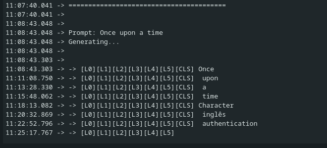

This was one my really fun to experience things. A streaming Language model on a tiny Microcontroller! Sounds stupid right? (I mean in a way its UNUSABLE and stupid.)

But thats precisely what we tried doing here, it was a random thought that maybe I should just google "esp32 llm" and I stumbled on a repo where someone else actually did all the work for me, that is running the smallest possible LLM on an old version of the ESP32. Lets me give you the reality of the ESP32 here: it has just 8MB of PSRAM and a dual-core processor running at around 240MHz, its not even close to couple of decade old Android phones, in fact it might be more relatable to your Vape machine (No I don't smoke, but my friends have one so I know)

Alright, so this is quick blog where we will take a quick overview look of Andrej Karpathy's beautiful little llama2.c repo, the existing ESP32_LLM project and finally someone elses llama2.cpp port of the original. And along the way we will try to deconstruct and understand transformer architecture, SIMD optimizations, and the art of squeezing every last drop of performance from embedded hardware.



I am not an expert in C, C++, Arduino or even GenAI. Am just another guy who is equally fascinated everyday by a lot of thing. So coming back to the point. I used heavy assistance from Claude Code to get most of the things here working and running quickly.

Starting from dissecting Andrej's C code to the C++ ported code and also all the ESP32 optimizations. If it were not for something like Claude Code I would be spending days straight trying to understand everything. Am not proud of what I did here, just gonna call it another day, another learning.

This whole C pointer based thing has been a nightmare for me since my college days, I was never the brightest in these things. I try to understand but thats pretty much it, nothing beyond that.

SO yeah take everything with a pinch of salt in this blog, I have tried to best explain whatever I originally intended to do, so if I conveyed it enough for you to understand I guess I'll pat my back BUT if I didn't I'll keep improving, maybe by my 30th blog or so I'll be good enough to explain these things with ease.

A huge thanks for even taking time to read, I super appreciate everyone, even if you came here to do a quick judgement, I don't mind.



Before diving into the implementation, let's understand what we're actually building.

## Part 1: How LLMs Really Work

**Note:** Instead of reading my AI generated junk I would suggest you to watch an explanation from 3Blue1Brown https://www.youtube.com/watch?v=wjZofJX0v4M its pretty good. But if you like reading like me, this is not that bad either, I tried to correct or fix whatever I could.

### The Transformer Architecture

At their core, Large Language Models are glorified pattern matching machines. They learn statistical relationships between tokens (pieces of text) and predict what comes next. And all of this happens inside the **transformer architecture**, which has three key components:

**1. Token Embeddings**
Every word (or sub-word) gets converted into a vector of numbers. Think of it as assigning each word a unique position in high-dimensional space where similar words cluster together.

```
"cat" → [0.2, -0.5, 0.8, ...]  (288 numbers for our model)
"dog" → [0.3, -0.4, 0.7, ...]  (similar to cat!)
"car" → [-0.9, 0.1, -0.3, ...] (far from cat)
```

**2. Attention Mechanism**
This is where the good stuff happens. For each new token, the model looks back at all previous tokens and asks: "Which past words are relevant to predicting the next word?"

The math is surprisingly simple:
- **Query (Q)**: "What am I looking for?"
- **Key (K)**: "What do I contain?"
- **Value (V)**: "What information should I pass forward?"

**Example:** Consider the sentence: *"The cat sat on the mat"*

When processing the word **"sat"**:
- **Q (Query)** for "sat": `[0.1, -0.3, 0.7, ...]` - Asking "what words relate to this action?"
- **K (Key)** for "cat": `[0.2, -0.2, 0.5, ...]` - Saying "I'm the subject doing something"
- **K (Key)** for "The": `[-0.1, 0.1, 0.0, ...]` - Saying "I'm just a determiner"
- **V (Value)** for "cat": Semantic information about the subject to propagate forward

The attention mechanism computes: "How much should 'sat' pay attention to 'cat' vs 'The'?" The answer: a lot to "cat", not much to "The".

Attention scores = softmax(Q × K^T) × V

**Attention scores** are similarity measures between the current token's query and all previous tokens' keys-higher scores mean "pay more attention to this past token." **Softmax** (borrowed from traditional ML classification) converts raw scores into probabilities that sum to 1.0, ensuring the model allocates exactly 100% of its "attention budget" across all past tokens.

**3. Feed-Forward Network (FFN)**
After attention, each token passes through a simple neural network:
- Project to larger space (288 → 768 dimensions in our model)
- Apply non-linearity (SiLU activation)
- Project back down (768 → 288)

**Why the dimension dance?** Linear transformations (matrix multiplies) can only draw straight lines in data space. **Non-linearity** (like SiLU: `x * sigmoid(x)`) adds curves and bends, letting the model learn complex patterns like "a cat can sit BUT a mat cannot." We upscale to 768 dimensions to give the network a larger "workspace" to perform these complex transformations, then compress back to 288 to keep the representation compact for the next layer. Think of it like unpacking a suitcase to rearrange items, then repacking it neatly.

These three components stack into **layers**. Our 260K model has 6 layers, while the 15M model has 8. Each layer refines the representation, building increasingly abstract understanding.

### The Inference Loop

Generating text is simple:
```
1. Start with prompt tokens
2. For each position:
   - Run through all layers
   - Get probability distribution over vocabulary
   - Sample next token
   - Append to sequence
3. Repeat until done
```

The computational bottleneck? **Matrix multiplication**. Attention and FFN are dominated by multiplying large matrices; exactly what we need to optimize.

### Memory Deep-Dive: "Once upon a time"

Let's walk through what happens in memory when we generate text for our 15M model (dim=288, layers=8, vocab=32000):

**Input:** "Once upon a time" → Tokenizer → `[9038, 2501, 263, 931]` (4 tokens)

**Token 0: "Once" (ID: 9038)**
```
1. Load token embedding: weights[9038 * 288] → x (288 floats = 1.1 KB)
   Formula: embedding_vector = weights[token_id × dim : (token_id + 1) × dim]
   Here: weights[9038 × 288 : 9039 × 288] gives us 288 floats representing "Once"

2. Layer 0:
   - Q projection: x (288) × wq (288×288) = q (288)     [Matrix: 82 KB]
   - K projection: x (288) × wk (288×48) = k (48)        [Matrix: 14 KB]
   - V projection: x (288) × wv (288×48) = v (48)        [Matrix: 14 KB]
   - Attention: No past tokens, just copy v → output
   - FFN: x (288) × w1 (288×768) = 221 KB multiplication
          hidden (768) × w2 (768×288) = 221 KB multiplication

3. Repeat for layers 1-7...

4. Final: x (288) * wcls (288×32000) = logits (32000)  [Matrix: 9.2 MB!]
   wcls = "weights classifier" - the final projection matrix that converts the
   288-dimensional representation into 32000 vocabulary logits (one score per token)

5. Sample from logits → Next token: "upon"
```

**Memory Inventory at Token 4 ("time"):**

**Critical (must be in PSRAM):**
- **Token embeddings:** 32000 × 288 = ~37 MB (looked up every token)
- **KV cache:** 8 layers × 4 positions × 48 dims × 2 (K&V) = ~3 KB (grows with sequence)
- **Layer weights (current):** ~1.2 MB (if streaming, only 1 layer loaded)

**Working buffers (can be in heap):**
- **x, xb, xb2:** 3 × 288 = ~3.5 KB
  x = current activation (layer input/output), xb = normalized version of x (buffer),
  xb2 = temporary computation buffer. Same buffers reused across all 8 layers to save memory
- **q, k, v:** 288 + 48 + 48 = ~1.5 KB (reused every layer)
- **hb, hb2:** 2 × 768 = ~6 KB
  hb = "hidden buffer 1", hb2 = "hidden buffer 2". These hold the expanded 768-dim
  intermediate activations during Feed-Forward Network computation (288→768→288).
  "Scratch space" = temporary working memory discarded after each layer
- **att scores:** 6 heads × 4 positions = ~100 bytes (attention weights)
- **logits:** 32000 = ~128 KB (final output, allocated once)

**Optional but nice (if space allows):**
- **All layer weights:** 8 × 1.2 MB = ~9.6 MB (avoid SD streaming)
- **Larger KV cache:** Pre-allocate for 256 positions = ~200 KB (avoid realloc)

**The Trade-off:**
For the 15M model (~60 MB total), we can't fit everything in 8 MB PSRAM. So we stream layer weights from SD (9.6 MB per token), keep embeddings in PSRAM (37 MB... wait, that doesn't fit either!). This is why we actually stream **embeddings too** in the 15M version-loading just the single token embedding needed (~1 KB) rather than the full table. The KV cache (grows to ~200 KB max) and working buffers (~15 KB) easily fit.

## Part 2: Karpathy's llama2.c - Pure C Simplicity

Andrej Karpathy's [llama2.c](https://github.com/karpathy/llama2.c) is a masterclass in clarity. It strips away all the complexity of modern ML frameworks and implements transformer inference in ~500 lines of pure C.

### Key Design Decisions

**Zero Dependencies**
No PyTorch, no TensorFlow, just `<stdio.h>` and `<math.h>`. This makes it perfect for embedded systems where you can't just `pip install` libraries.

**Memory-Mapped Weights**
Instead of parsing model files, llama2.c uses a brilliant trick:
```c
FILE* file = fopen("model.bin", "rb");
float* data = mmap(NULL, file_size, PROT_READ, MAP_PRIVATE, fd, 0);
```

Breaking down `mmap()` parameters:
- `NULL`: Let OS choose where to map (we don't care about the address)
- `file_size`: Map the entire file into memory
- `PROT_READ`: Read-only access (weights don't change during inference)
- `MAP_PRIVATE`: Changes stay local to this process (not written back to file)
- `fd`: File descriptor pointing to our model.bin
- `0`: Start at offset 0 (beginning of file)

The entire model file becomes a read-only array in memory. Want the attention weights for layer 3? Just pointer arithmetic:
```c
float* layer3_attn = data + offset_layer3;
```

**Single Forward Pass**
The core is one function: `forward()` that runs a single token through all layers. Let's trace how token **"Hello"** (ID: 15043) flows through:

```c
float* forward(Transformer* t, int token, int pos) {
    // token = 15043 ("Hello"), pos = 0 (first position)
    // dim = 288, n_layers = 8

    // STEP 1: Get token embedding
    // Copy the 288-dimensional vector for "Hello" from embedding table
    memcpy(x, t->weights.token_emb + 15043*288, 288*sizeof(float));
    // x now holds: [0.31, -0.52, 0.18, ...] (288 floats representing "Hello")

    // STEP 2: Process through each transformer layer
    for (int l = 0; l < 8; l++) {  // 8 layers for 15M model
        // Layer 0: Input is raw "Hello" embedding
        // Layer 1-7: Input is refined representation from previous layer

        // 2a. Normalize (like batch norm from traditional ML)
        rmsnorm(xb, x, w->rms_att + l*288, 288);
        // xb = normalized version of x (mean=0, prevents exploding values)

        // 2b. Create Query, Key, Value for attention
        matmul(q, xb, w->wq + l*288*288, 288, 288);     // Query: "what am I looking for?"
        matmul(k, xb, w->wk + l*288*48, 288, 48);       // Key: "how should others find me?"
        matmul(v, xb, w->wv + l*288*48, 288, 48);       // Value: "what info do I carry?"

        // 2c. Store K,V in cache for future tokens to attend to
        memcpy(key_cache + l*seq_len*48 + pos*48, k, 48*sizeof(float));
        memcpy(val_cache + l*seq_len*48 + pos*48, v, 48*sizeof(float));

        // 2d. Compute attention over all past tokens (just ourselves at pos=0)
        // For each head: att_score = softmax(q · K_cache) · V_cache
        // Result: weighted combination of all past token values
        // ... attention computation (6 heads × pos+1 tokens)

        matmul(xb2, xb, w->wo + l*288*288, 288, 288);   // Project attention output
        x = x + xb2;  // Residual connection (add input back)

        // 2e. Feed-forward network (gives model "thinking time")
        rmsnorm(xb, x, w->rms_ffn + l*288, 288);        // Normalize again
        matmul(hb, xb, w->w1 + l*288*768, 288, 768);    // Expand to 768 dims
        matmul(hb2, xb, w->w3 + l*288*768, 288, 768);   // Parallel expansion
        // Apply SiLU: hb = hb * sigmoid(hb) ⊙ hb2 (element-wise)
        matmul(xb, hb, w->w2 + l*768*288, 768, 288);    // Compress back to 288
        x = x + xb;  // Residual connection

        // After layer 0: x represents "Hello" with basic patterns
        // After layer 7: x represents "Hello" with deep contextual understanding
    }

    // STEP 3: Convert final representation to vocabulary probabilities
    rmsnorm(x, x, w->rms_final, 288);           // Final normalization
    matmul(logits, x, w->wcls, 288, 32000);     // 288 → 32000 vocabulary logits
    // logits[0] = -2.3  (token 0 = "<unk>", unlikely)
    // logits[1079] = 5.7  (token 1079 = "world", likely after "Hello"!)
    // logits[727] = 4.2   (token 727 = "there", also likely)

    return logits;  // Return 32000 scores, softmax + sample picks next token
}
```

The beauty: same code processes every token, whether it's the first "Hello" or the 200th token in a long story!

Clean, simple, and beautifully understandable.

### Why This Matters for Embedded

llama2.c proved that you don't need gigabytes of RAM, GPU clusters, gbs large libraries to run inference. A bit of math and a few megabytes of space and a CPU are enough for small models. This opened the door for embedded implementations.

## Part 3: ESP32 Optimizations - Making it FAST

Raw C is portable, but it's not optimized. Enter [esp32-llm by DaveBben](https://github.com/DaveBben/esp32-llm), which took llama2.c and made it **scream** on ESP32 hardware.

### Optimization 1: ESP-DSP SIMD

The ESP32-S3 has SIMD (Single Instruction, Multiple Data) instructions through the **ESP-DSP library**. Instead of multiplying floats one at a time, we can do 4 at once.

**Before (scalar code):**
```c
float dot_product(float* a, float* b, int n) {
    float sum = 0.0f;
    for (int i = 0; i < n; i++) {
        sum += a[i] * b[i];  // One multiply per cycle
    }
    return sum;
}
```

**After (SIMD):**
```c
#include <esp_dsp.h>

float dot_product(float* a, float* b, int n) {
    float sum = 0.0f;
    dsps_dotprod_f32_aes3(a, b, &sum, n);  // 4x multiplies per cycle!
    return sum;
}
```

The `dsps_dotprod_f32_aes3()` function uses the Xtensa DSP extensions to process 4 floats per instruction. **Instant 2-3x speedup** on the matrix multiplications that dominate inference time.

### Optimization 2: Dual-Core Parallelization

The ESP32-S3 has two cores. Why use just one?

Matrix multiplication is embarrassingly parallel. To compute `C = A × B`, you can split the output rows:
- Core 0: Compute rows 0-127
- Core 1: Compute rows 128-255

**Implementation with FreeRTOS:**
```c
// Task running on Core 1
void matmul_task(void* params) {
    while (true) {
        xSemaphoreTake(semaDataReady, portMAX_DELAY);  // Wait for work

        MatMulTaskParams* p = (MatMulTaskParams*)params;

        // Compute assigned rows
        for (int i = p->start; i < p->end; i++) {
            dsps_dotprod_f32_aes3(p->x, p->w + i*p->n, p->xout + i, p->n);
        }

        xEventGroupSetBits(xEventGroup, TASK_1_BIT);  // Signal done
    }
}

void matmul(float* xout, float* x, float* w, int n, int d) {
    // Matrix multiply: xout = x × w
    // x is (1 × n), w is (n × d), result xout is (1 × d)
    // Each output element xout[i] = dot_product(x, w_row_i)

    // CORE 0: Compute first half of output (rows 0 to d/2-1)
    for (int i = 0; i < d/2; i++) {
        dsps_dotprod_f32_aes3(x, w + i*n, xout + i, n);
    }
    // Example: If d=288, Core 0 computes xout[0..143]

    // CORE 1: Compute second half of output (rows d/2 to d-1) in PARALLEL
    matmul_params->x = x;                // Share input vector
    matmul_params->w = w + (d/2)*n;      // Point to second half of weight matrix
    matmul_params->start = d/2;          // Core 1 starts at row 144
    matmul_params->end = d;              // Core 1 ends at row 287
    xSemaphoreGive(semaDataReady);       // Wake up Core 1 task

    // Wait for Core 1 to finish its rows
    xEventGroupWaitBits(xEventGroup, TASK_1_BIT, pdTRUE, pdFALSE, portMAX_DELAY);
    // Now xout[0..287] is complete, with each core computing half
}
```

**How the split works:** Imagine multiplying a vector by a 288×288 matrix. We need 288 dot products. Core 0 computes dot products 0-143 while Core 1 simultaneously computes dot products 144-287. Since the two halves are independent, we get near-perfect 2x speedup (limited only by synchronization overhead).

**Result:** Near-2x speedup on matrix operations. Combined with SIMD, we're looking at **4-5x faster than naive C code**.

### Optimization 3: PSRAM Configuration

The ESP32-S3 supports different PSRAM modes:
- **QSPI PSRAM**: 4-bit interface, ~40 MB/s bandwidth
- **OPI PSRAM**: 8-bit interface, ~80 MB/s bandwidth

Simply enabling OPI mode in Arduino IDE settings gives a free 2x memory bandwidth boost-critical when you're constantly fetching weights from PSRAM.

**Combined Performance:**
With all optimizations, the 260K parameter model achieves **~25 tokens/second** on the ESP32-S3. That's 130ms per token-totally interactive!

## Part 4: The Arduino Port

esp32-llm used ESP-IDF. It's the official Espressif framework, heavy, and feature packed and all, BUT I wanted something I was used to already that is the Arduino IDE. And the Sketch files in Arduino IDE is a cpp thing. So we needed a port of the original llama2 and add the optimizations on top of it. A quick google search and this is where [leloykun's llama2.cpp](https://github.com/leloykun/llama2.cpp) comes in.

### Architecture Overview

Our implementation has four main components:

**1. llm_core.h/cpp** - The inference engine
```c
typedef struct {
    Config config;              // Model hyperparameters
    TransformerWeights weights; // Pointers to all weight matrices
    RunState state;             // Activation buffers
    v4sf* data;                 // PSRAM model buffer
} Transformer;

v4sf* forward(Transformer* t, int token, int pos);  // Core inference
```

**2. tokenizer.h/cpp** - BPE tokenizer
Converts text ↔ token IDs using byte-pair encoding vocabulary.

**3. sampler.h/cpp** - Token sampling strategies
- Greedy: Pick highest probability token
- Temperature: Add randomness (temperature = 1.0 = original distribution)
- Top-p (nucleus): Sample from top 90% probability mass

**4. Main sketch (.ino)** - Ties it together
```c
void setup() {
    FFat.begin();  // Mount filesystem
    build_transformer(&transformer, "/stories260K.bin");
    build_tokenizer(&tokenizer, "/tok512.bin");
    build_sampler(&sampler, vocab_size, 1.0f, 0.9f);
}

void loop() {
    if (Serial.available()) {
        String prompt = Serial.readStringUntil('\n');
        generate(prompt.c_str(), 256);
    }
}
```

### Version 1: Stories260K (Pure PSRAM)

The first version loads a 1.1MB model entirely into PSRAM:

**Memory Layout:**
```
PSRAM (8 MB total):
├── Model weights: 1.1 MB
├── Token embeddings: ~320 KB
├── KV cache: ~500 KB (stores attention keys/values)
├── Activation buffers: ~200 KB
└── Free: ~5.8 MB
```

**Performance:**
- Model load time: ~2 seconds
- Inference speed: **25-30 tokens/second**
- Quality: Basic story generation (260K parameters is tiny!)

**Storage:**
Uses FFat filesystem on flash (9MB partition) via `upload_to_flash.sh`:
```bash
mkfatfs -c data/ -s 0x9E0000 ffat.bin
esptool.py write_flash 0x611000 ffat.bin
```

This version proves the concept: LLM inference on ESP32 is totally viable. (But un-readable unless you enjoy reading some garbage but totally good english texts)

Here is an output from it:
```markdown
16:08:46.149 -> Prompt: Once upon a time
16:08:46.149 -> Generating...
16:08:46.149 -> 
16:08:46.181 -> Once upon a time, there was a little girl named Lily. She had a clothes that she loved to bring them a lot of fake stones. One day, Lily's mom asked her to come to the stone with all her toys. Lily was so excited and said, "We should have fun together and get all surprises."
16:08:49.662 -> As Lily went to her friends, Lily saw a small goat in the dishwasher. The goat stopped and went to a snake. Lily and her mom were very upset and didn't want to eat it. 
16:08:52.914 -> As they were playing, Lily's dad accidentally felt bad for him. Lily's dad smiled and said, "I can bring some path to take care of your dictionary
```

### Version 2: Stories15M (SD Card Streaming)

But what about larger models? A 15M parameter model is **58MB**-way beyond our 8MB PSRAM.

**NOTE:** This is not the most optimized way of doing it, one could say am not streaming batches of data, when I got the experimental code written by Claude and tested it within a few mins of run, I could smell the solder on the chip, so whatever documented below about this streaming thing is a single experiment. And since I don't have another ESP32 lying around and also considering that the event for which I was preparing this was near I didn't really have the freedom to work out calculations properly. Maybe another time after event i could pursue into a much-much more optimized properly calculated version of this whole thing. I have pretty cool ideas to make this whole thing more fast but I can't spend days on it for now atleast. Maybe stay tuned sometime in Jan I might push another update.

**The Problem:**
- Model size: 58 MB
- Available PSRAM: 8 MB
- Simple math: Won't fit!

**The Solution: Layer-by-Layer Streaming**

Instead of loading the entire model, we stream it from SD card:

**What Gets Loaded Once:**
```
PSRAM (persistent):
├── Token embeddings: ~7 MB (Some part of the embeddings are also streamed, it may sit theoretically but its not practical)
├── KV cache: ~2 MB (persistent across tokens)
├── Final RMS weights: ~1 KB
├── Activation buffers: ~500 KB
└── Layer buffer: ~2 MB (reused!)
```

**What Gets Streamed Per Token:**
```
For each of 8 layers:
  1. Seek to layer offset in SD file
  2. DMA read ~1.2 MB layer weights → layer_buffer
  3. Compute attention + FFN using layer_buffer
  4. Overwrite layer_buffer with next layer
```

**PSRAM Usage Breakdown:**

*Before inference (model load):*
```
PSRAM (8 MB total):
├── Layer buffer: 2 MB (allocated, empty)
├── Activation buffers: ~500 KB (x, xb, q, k, v, hb, etc.)
├── KV cache: ~200 KB (pre-allocated for 256 tokens)
├── Logits buffer: ~128 KB
└── Free: ~5.2 MB
────────────────────────────────
Used: ~2.8 MB (35%)
```

*During inference (processing token 50 of "Once upon a time..."):*
```
PSRAM (8 MB total):
├── Layer buffer: 2 MB (currently holds Layer 3 weights)
├── Activation buffers: ~500 KB (actively computing FFN)
├── KV cache: ~200 KB (storing keys/values for 50 past tokens)
├── Logits buffer: ~128 KB (output probabilities)
└── Free: ~5.2 MB (unchanged)
────────────────────────────────
Used: ~2.8 MB (35%) - stays constant!
```

PSRAM usage doesn't grow during inference! The layer buffer is reused 8 times per token, and KV cache was pre-allocated. Only heap usage varies slightly as temporary buffers are allocated/freed during computation.

We only need ONE layer's weights at a time! The 2MB layer buffer gets reused 8 times per token.

**Implementation:**
```c
typedef struct {
    size_t offset;  // Byte offset in SD file
    size_t size;    // Layer size in bytes
} LayerInfo;

typedef struct {
    // ... existing fields
    File sd_file;               // SD card file handle
    bool use_streaming;         // Enable streaming mode
    v4sf* layer_buffer;         // 2MB PSRAM buffer (reused)
    LayerInfo layer_offsets[8]; // Offset table
} Transformer;

bool load_layer_from_sd(Transformer* t, int layer) {
    t->sd_file.seek(t->layer_offsets[layer].offset);
    size_t bytes = t->sd_file.read(
        (uint8_t*)t->layer_buffer,
        t->layer_offsets[layer].size
    );

    // Remap weight pointers to layer_buffer
    v4sf* ptr = t->layer_buffer;
    t->weights.rms_att_weight = ptr; ptr += dim;
    t->weights.wq = ptr; ptr += dim * dim;
    // ... map all layer weights

    return bytes == t->layer_offsets[layer].size;
}

v4sf* forward(Transformer* t, int token, int pos) {
    for (int l = 0; l < n_layers; l++) {
        // STREAMING: Load layer from SD
        if (t->use_streaming) {
            if (!load_layer_from_sd(t, l)) return NULL;
        }

        // Compute layer (same code as before!)
        rmsnorm(xb, x, t->weights.rms_att_weight, dim);
        // ... rest of layer computation
    }
}
```

**Performance Reality Check:**

*Bottleneck Analysis (estimated, unverified):*
```
Per token time: ~120,000 ms (yes, 2 minutes!)

SD card reads (8 layers):     ~100,000 ms (83%)
  - 8 layers × 1.2 MB = 9.6 MB total
  - SD SPI read speed: ~100 KB/s (slow!)
  - Seek overhead: ~50 ms per layer

Matrix multiply (SIMD):        ~15,000 ms (13%)
Attention + other:             ~5,000 ms (4%)
```

**Note:** These timing breakdowns are rough estimates based on observed total inference time and theoretical I/O speeds. We haven't instrumented each component with precise profiling, so the actual bottleneck distribution may differ. What we *know* for certain: total time is ~2 minutes per token, and SD card I/O is the dominant factor (switching to internal flash obviously shows immediate improvement).

Still, running a 15M parameter model on an ESP32-S3 at all is pretty cool, even at 0.5 tokens/sec.

**Disclaimer on performance analysis:** Throughout this section, speed estimates (especially the 83% I/O / 13% compute split) are educated guesses based on theoretical SD card speeds and observed total inference time. Without cycle-accurate profiling instrumentation, we can't definitively say "I/O is 83% of the bottleneck." What we *can* say: the implementation works, it's slow (~2 min/token), and faster storage would likely help significantly. Future work should add proper timing instrumentation to each component for accurate bottleneck identification.

Here is an output from it:
[TODO: attach the image from the disk here]


## Conclusion

We started with Karpathy's llama2.c, absorbed DaveBben's ESP32 SIMD wizardry, and built a fully functional LLM inference engine for ESP32-S3 in Arduino. Along the way I learned quite some stuff:

- **Transformers are simple** Just embeddings + attention + FFN, repeated (But in pure honesty as per Novmeber 2025 I still code a transformer on my own even with all torch helper funcs)
- **Cores and Memory matters**, I need to sit on this again another time and work out the intricates again when time allows, i can sort of envision a much properly written and working version.

The 260K model proves that **LLM inference on microcontrollers can be done**. The 15M streaming experiment demonstrates both the possibilities and current limitations of running larger models on constrained hardware. My next experiment is to fine-tune the 260K for a quick FAQ sort of system not sure if that'll work but lets see.

Most importantly, we now have a clean, understandable codebase that demystifies LLM inference. No PyTorch black boxes, no CUDA, just C code, SIMD intrinsics, and the ESP32-S3 doing its best.

## Resources

- **Karpathy's llama2.c:** https://github.com/karpathy/llama2.c
- **esp32-llm (SIMD + dual-core):** https://github.com/DaveBben/esp32-llm
- **llama2.cpp (Arduino port base):** https://github.com/leloykun/llama2.cpp

*Built for a conference badge - because why have a dumb badge when you can have one that runs LLMs locally?*
