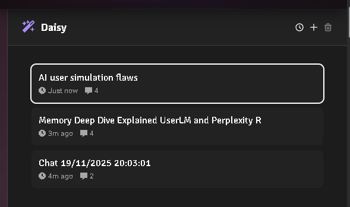

This is a short post just to showcase how I added a quick simple Prompt AI API to my portfolio site here at ajv009.com.

Do note that the AI sidebar will only be available to you if you have enabled support for Chrome AI and the Prompt AI API on your browser. Read more about it here: https://developer.chrome.com/docs/ai/built-in and https://developer.chrome.com/docs/ai/prompt-api 

Yes its experimental and requires certain browser flags to be enabled and so on. Some time in March 2026 we can expect it to be running stable on some browsers (hopefully)

**Following is the demo video of it:**



**Video: [Simple sidebar Chatbot on my portfolio site](https://www.youtube.com/watch?v=Vscy2g4l1Xo)**

**Features:**
1. It only has context of whats within the view port, a full fledged site wide RAG was implemented internally but its crazy slow due to the extra steps I added and I scraped it off for the time being. Maybe as the API gets to a stable release I'll revisit this and modify as needed.
2. In the history page the session has a name generated automatically in the background.

## The Good

1. Soon such an API will be available across every browser on the planet.
2. Even being a small model its quite chatty. (Which is often good, for me it meant proper sentence forming when needed)

## The Bad

1. The initial Session is quite slow. I am hoping in future these models will be pre-loaded to the memory ready to init a session any time any site or process requires it.
2. Heavy context limitation, yeah it only supports around ~4K
3. Also the model is not that good for extensive RAGs or anything too complex even when using structured output or for any local tool use.

## Possibilities:
The possibilities are obviously endless. I spent a day trying to architect and make at the same time, sure there are some problems which I'll explain in a moment but it also made me realize whats this good for and whats this bad for.

My goal was to have an absolutely free and private ai experience inside my site. One of the biggest problems I had is doing a proper RAG that involves a bit of agentic decision making to switch between different contexts and such. But as soon as it took an entire blog page as an input it failed or hit the limit. Few ways to mitigate this is pre-generate page summaries and store them in some meta for later reference for these chatbots, but then that creates friction for my quick edits and changes in the blogs. Then another idea was chunk and feed, but we don;t have any official embedding API as such in Chrome so again hopeless, Maybe I could do a fuzzy search within the chunks, would work for spelling mistakes and such. MAYBE transform the search bar itself.
But the goal was to keep everything strictly within the limits of the API. Sure I could easily use something like WebNN or TF-Lite and such to run an embedding model or language model BUT then that defeats the purpose of single shared resource for all sites.

Keeping the RAG part aside, once this is a widespread AI across browsers I can see most companies implementing this as a first hit model locally for support chats and such scenarios, and the cloud ones act as hosted alternative if the confidence of the response fail or something or that sorts. But since this being a very small model its supposed to be properly architected, one wrong decision will cost your customers or usage, because these models are steerable but not always properly instruction following.

