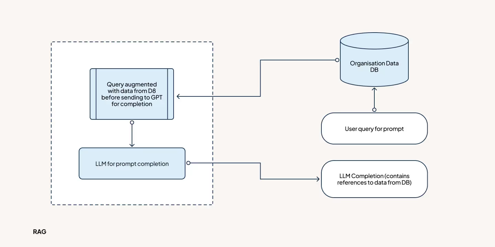
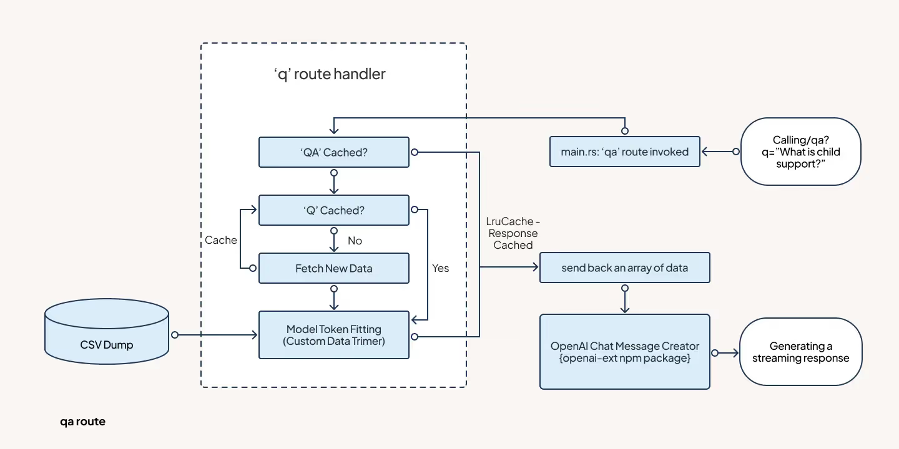
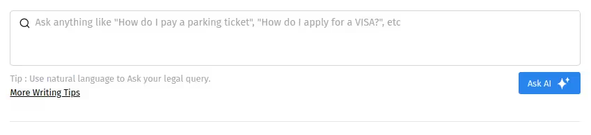
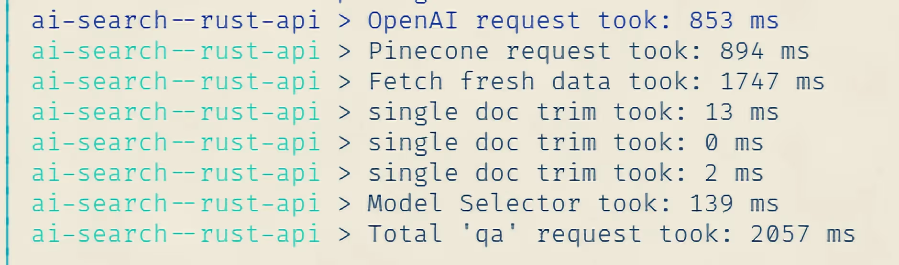

In this third installment of the 'Revolutionizing Search with AI' series, we further delve into the power of semantic search with RAG to elevate search engine capabilities. In our [initial blog](https://www.qed42.com/insights/revolutionizing-search-with-ai-semantic-search-and-rag), we provided an overview of the complete application, and the [second blog](https://www.qed42.com/insights/revolutionizing-search-with-ai-diving-deep-into-semantic-search) delved into the intricacies of semantic search and the backend of our demo application.

Our primary objective has been to enhance the search experience through the introduction of a feature known as 'Ask AI,' which is similar to Google's 'Converse' function in the new Google Search Generative Experience (SGE). This feature goes beyond basic keyword searches. It considers all the relevant results from our previous searches, leveraging data from the Pinecone Vector Database.

This information then acts as the context for our new query and is sent to the OpenAI Chat API to generate a dynamic text response in real time. We call this process RAG or Retrieval Augmented Generation. By weaving these features together, we're confident that the [AI-powered search system](https://www.qed42.com/insights/a-complete-guide-to-testing-ai-and-ml-applications) we're building would transform the search engine landscape.

In this blog, we'll explore RAG and how we've applied its principles to create a more user-friendly search engine experience.

## Understanding Retrieval Augmented Generation (RAG)

Back in 2020, [Patric Lewis and his team at Meta introduced a concept known as Retrieval Augmented Generation](https://ai.meta.com/blog/retrieval-augmented-generation-streamlining-the-creation-of-intelligent-natural-language-processing-models/). However, it wasn't until organizations recognized the potential of advanced language models like GPT-4 from OpenAI and Claude 2 from Anthropic, with their ability to handle large amounts of contextual information, that this technique gained widespread adoption.

These models allow us to enhance the quality of generated content by incorporating real-time data. As we started to use ChatGPT and similar large language models, it became evident that while they excel at content generation, they are not without their limitations.

### Drawbacks of current LLMs

- **Limited to training data**: These models, like static textbooks, rely solely on the data they were initially trained on. As a result, they lack knowledge of recent developments not included in their training data.
- **Broad but not specialized**: Foundational language models like GPT and Claude are built to handle a wide range of tasks effectively. Even so, they may not perform as well when it comes to specialized knowledge and domain-specific tasks.
- **Lack of transparency**: Since these models are designed to handle a wide range of information from various sources, it can be challenging to trace which specific data they used to generate their responses.
- **Cost and expertise barrier**: Training or fine-tuning these models can be financially challenging for many organizations. For instance, a cutting-edge model like GPT requires investments in the millions of dollars, making it a costly option, particularly for smaller companies.
- **Hallucinations**: Because these models are general and don't always have access to reference data, they can sometimes generate responses that may not be entirely accurate.

### How does RAG work

RAG begins by retrieving data. In our case, this involves a semantic search using the Pinecone Vector Database API. This search finds relevant information for the user's query.

Next, RAG enhances the initial user query with this data. It then feeds this improved prompt into a Generative AI model, like OpenAI's GPT-4 via their '[Chat Completion API](https://platform.openai.com/docs/guides/gpt/chat-completions-api).'

This process results in the final response or answer to the user's query. RAG combines retrieval and generation techniques to provide context-aware and informed responses.



In our system, we employ [semantic search within a vector database](https://www.searchenginejournal.com/semantic-search-with-vectors/467574/) where our data is stored. This database is designed to understand natural language, such as the user's query or prompt for an LLM.

What sets it apart is its flexibility; it can be updated or modified just like any other database. It solves the challenge of dealing with static or frozen LLMs.

### Benefits of RAG

- Offers a dynamic experience, unlike static models.
- Tailored to meet specific business needs by incorporating relevant data.
- Enhances transparency by avoiding the black box issue.
- More [cost-effective compared to training or fine-tuning a language model](https://hackernoon.com/the-challenges-costs-and-considerations-of-building-or-fine-tuning-an-llm) from scratch.
- Simplifies the process by eliminating the need for complex prompts.
- Empowers to create domain-specific chatbots and similar apps in minutes.

## Blending Pinecone Vector Store with GPT

In RAG, two key components play a vital role. First, is the **vector database**, which serves as the repository of updated information. For our purposes, we rely on the Pinecone Vector Database API. Its user-friendly nature and flexibility makes it an ideal choice. The second component is the text generation model, typically an LLM like **GPT or Claude.**

Combining the Pinecone Vector Store with the power of GPT brings a new dimension to the search experience. We seamlessly integrated these elements to go beyond mere semantic search, delivering a more comprehensive and context-aware solution.

### A deeper dive into our backend solution

Here is a glimpse of our solution.



Similar to the 'q' route we developed in the previous [blog](https://www.qed42.com/insights/revolutionizing-search-with-ai-diving-deep-into-semantic-search) of the series, we are using Rust and a different route namely 'qa':

In our demo, we focused on optimizing a specific aspect: latency. To achieve this, we implemented multiple in-memory caches.

```rust
// Defining the main function for the 'qa' route of the API
pub async fn query_qa_api(
    query: HashMap<String, String>, // The query parameters received in the request
    client: Arc<Client>, // The shared HTTP client
    q_cache: Arc<Mutex<LruCache<String, Vec<ResponseMatch>>>>, // The shared LRU cache for 'q' route
    qa_cache: Arc<Mutex<LruCache<String, QaResponseWrapper>>>, // The shared LRU cache for 'qa' route
) -> Result<impl warp::Reply, warp::Rejection> {

    // Extracting and Decoding the query string from the URL
    let input = decode(query.get("q").unwrap_or(&String::new())).unwrap();
    let q_cache_key = input.clone();

    // Checking the 'qa' cache for the query
    {
        let mut qa_cache = qa_cache.lock().await;
        if let Some(cached_qa_response_wrap) = qa_cache.get(&q_cache_key) {
            // If the query is in the cache, return the cached result
            // Will include the trimmed data points
            return Ok(warp::reply::json(&cached_qa_response_wrap.clone()));
        }
    }

    // If the query is not in the 'qa' cache
    let mut qa_response: Vec<QaResponse> = vec![];
    let q_response_matches: Vec<ResponseMatch>;

    // Checking the 'q' cache for the query (pinecone responses)
    // We are dependent on the response from Pinecone,
    //Since we are returning the same data but trimmed to fit inside a specific model
    let mut q_cache = q_cache.lock().await;
    if let Some(q_cached_response) = q_cache.get(&q_cache_key) {
        // If the query is in the 'q' cache, get the result from the cache
        q_response_matches = q_cached_response.clone();
    } else {
        // If the query is not in the 'q' cache, fetch new data and update the cache
        q_response_matches = fetch_new_data(client, input).await;
        q_cache.put(q_cache_key.clone(), q_response_matches.clone());
    }

    // Initializing the BPE tokenizer and counting the total tokens of the rows/documents
    let bpe = cl100k_base().unwrap();
    let mut _total_token_count: usize = 0;
    for q_response_match in q_response_matches {
        let data = DATA.lock().await;
        // Find the matching record in the dataset
        if let Some(record) = data.iter().find(|&record| record.id == q_response_match.id) {
            let tokens = bpe.encode_with_special_tokens(&record.data);
            // Create a response object and add it to the response array
            // Because we are using a slightly different response structure
            qa_response.push(QaResponse {
                id: q_response_match.id,
                data: record.data.clone(),
                score: q_response_match.score,
                token_count: tokens.len(),
                adjusted_ratio: None,
            });
            // Update the total token count
            _total_token_count += tokens.len();
        }
    }

    // Select the model based on the total token count and the response array
    // This function also manages the trimming of the data (Will explore the function next)
    let (qa_response, model) = model_selector(qa_response, _total_token_count);

    // Create a wrapper for the response (To accommodate the model name)
    let qa_response_wrap = QaResponseWrapper {
        model: model,
        data: qa_response,
    };

    // Update the 'qa' cache with the new response
    {
        let mut qa_cache = qa_cache.lock().await;
        qa_cache.put(q_cache_key, qa_response_wrap.clone());
    }

    // Return the response
    Ok(warp::reply::json(&qa_response_wrap.clone()))
}
```

Let's explore the custom trimmer we implemented, known as the 'model_selector function'.

```rust
// This function decides the model to use based on the total token count and
// trims the documents if needed.
pub fn model_selector(
        rows: Vec<QaResponse>,
        _total_token_count: usize
) -> (Vec<QaResponse>, String) {
    // Initialising a model limit variable.
    struct TokenLimit {
        model: &'static str,
        token: usize,
    }
    let max_token_limit: Vec<TokenLimit> = vec![
        // For the demo purposes we limited our selection to just GPT-4,
        // But for a prod build one might have to build a more steerable GPT-3 based solution
        TokenLimit { model: "gpt-4", token: 7192 },
        TokenLimit { model: "gpt-4-32k", token: 31768 },
    ];

    // Initialising a Byte Pair Encoding function
    // cl100k is a specific method used to break up words for GPT-3 and GPT-4
    let bpe = cl100k_base().unwrap();

    // Loop over the models in ascending order of their token limit
    for window in max_token_limit.windows(2) {
        // Store current and next model token limits
        let (current, next) = (&window[0], &window[1]);
        // If the total tokens exceed the current model's limit but not the next one
        if _total_token_count > current.token && _total_token_count <= next.token {
            // If the total tokens are closer to the lower limit, use the current model and trim to its limit
            if _total_token_count <= current.token + (next.token - current.token) / 2 {
                // document_vec_trimmer is a custom function used to trim a bunch of provided documents
                // to the specified limit
                let trimmed_documents = document_vec_trimmer(rows, _total_token_count, current.token, &bpe);
                // Return the trimmed documents and the selected model
                return (trimmed_documents, current.model.to_string());
            // If the total tokens are closer to the higher limit, use the next model and trim to its limit
            } else {
                let trimmed_documents = document_vec_trimmer(rows, _total_token_count, next.token, &bpe);
                // Return the trimmed documents and the selected model
                return (trimmed_documents, next.model.to_string());
            }
        // If total tokens do not exceed the current model's limit, use it and no need to trim
        } else if _total_token_count <= current.token {
            let trimmed_documents = document_vec_trimmer(rows, _total_token_count, current.token, &bpe);
            // Return the trimmed documents and the selected model
            return (trimmed_documents, current.model.to_string());
        }
    }

    // If total tokens exceed all model's limits, use the last model and trim to its limit
    let last_model = &max_token_limit[max_token_limit.len() - 1];
    let trimmed_documents = document_vec_trimmer(rows, _total_token_count, last_model.token, &bpe);
    // Return the trimmed documents and the selected model
    return (trimmed_documents, last_model.model.to_string());
}
```

Now, let's consider a crucial aspect of the trimming process, the 'document_vec_trimmer function.' We've developed a smart trimmer that doesn't simply remove content to fit within a model's constraints. It takes into account Pinecone scores to trim in a way that respects the document's importance.

Please note that another efficient approach involves breaking down the original data into smaller segments before vectorizing them. This would allow us to include key source data-related information in the metadata of the database entry.

For our demo development, we opted for a more simpler approach.

```rust
// This function trims multiple documents to fit within a global token limit.
// Each document is trimmed proportionally based on their scores.
// Higher-scored documents are trimmed less.
pub fn document_vec_trimmer(
        mut rows: Vec<QaResponse>,
        _total_token_count: usize,
        target_token_size: usize,
        bpe: &CoreBPE
) -> Vec<QaResponse> {
    // If the total tokens fit the target size, or there are no rows, return as is.
    if _total_token_count <= target_token_size || rows.is_empty() {
        return rows;
    }

    // Normalize scores between the score range for easier calculations later.
    let min_score = rows.iter().map(|row| row.score).min_by(|a, b| a.partial_cmp(b).unwrap()).unwrap_or(0.0);
    let max_score = rows.iter().map(|row| row.score).max_by(|a, b| a.partial_cmp(b).unwrap()).unwrap_or(0.0);
    let score_range = max_score - min_score;
    // The formula of normalization here is "X_normalized = (X - X_min) / (X_max - X_min)"
    for row in rows.iter_mut() {
        row.score = (row.score - min_score) / score_range;
    }
    // This normalization takes the current range into consideration
    // And then normalizes the scores into that range

    // Calculate adjusted scores to prioritize high scores even more.
    let mut adjusted_scores = Vec::with_capacity(rows.len());
    for row in &rows {
        // Square the score to amplify the differences
        let adjusted_score = row.score.powf(2.0);
        adjusted_scores.push(adjusted_score);
    }

    // Normalize adjusted scores so that they sum up to 1.
    // (Unlike the previous implementation that takes the score range into consideration)
    let total_adjusted_score_reciprocal = 1.0 / adjusted_scores.iter().sum::<f64>();

    // The normalization formula here is "X_normalized = X / Sum(X)"
    for (row, &adjusted_score) in rows.iter_mut().zip(adjusted_scores.iter()) {
        row.adjusted_ratio = Some(adjusted_score * total_adjusted_score_reciprocal);
    }

    // Calculate how many tokens to trim from each document based on their adjusted ratio.
    // Set a minimum limit to prevent a document from losing all its tokens.
    let min_tokens_in_doc = 10;

    // Calculate the total number of tokens to remove across all documents,
    let excess_tokens = _total_token_count as f64 - target_token_size as f64;

    // Calculate the ratio of the total tokens that need to be removed.
    let trim_ratio = excess_tokens / _total_token_count as f64;

    // For each row (document) in the rows vector...
    for row in rows.iter_mut() {
        // "(1.0 - trim_ratio)" Calculates the ratio of tokens to keep
        // Multiple with current row token count to get the actual count extracted from
        // the ratio. Then we round it to avoid any removing or keeping the fractional token
        let target_tokens = ((1.0 - trim_ratio) * row.token_count as f64).round() as usize;

        //Ensure we don't go below min_tokens_in_doc
        let target_tokens = max(target_tokens, min_tokens_in_doc);

        // Trim only if the target count is lesser than the current row token count
        if row.token_count > target_tokens {

            // context_trimmer is a single document straight forward document trimmer
            row.data = context_trimmer(&row.data, target_tokens, bpe);

            // Update the value
            row.token_count = target_tokens;
        }
    }

    // Return the updated rows
    rows
}
```

Take a quick look at the final function within this API, which is the simple 'context_trimmer'.

```rust
// This function trims the context to fit the token_count
// limit using Byte Pair Encoding (BPE).
pub fn context_trimmer(context: &str, token_count: usize, bpe: &CoreBPE) -> String {

    // encode the context with BPE
    let tokens = bpe.encode_with_special_tokens(context);

    // If the token count exceeds the limit, trim the tokens
    if tokens.len() > token_count {

        // take the first token_count tokens
        let trimmed_tokens = tokens[..token_count].to_vec();

        // decode back into a string
        let trimmed_context = bpe.decode(trimmed_tokens).unwrap();

        // Return the updated trimmed context
        return trimmed_context;
    }

    // If no trim is needed, return the original context
    context.to_string()
}
```

The remaining components of the streaming solution are managed within the demo React site that we created.



We are using the 'openai-ext' library to handle streaming responses.

It's worth noting that the necessity for a third-party library like 'openai-ext' may no longer be required with the introduction of 'openai-node' v4, which offers built-in streaming capabilities.

```javascript
// This function is triggered with the "Ask AI" button
const fetchBoxContent = async () => {
    try {
      // requestState stores the current state of the response
      // "inProgress" means the request is currently being generated
      // When "inProgress" the Ask AI button shows "Stop Response"
      if (requestState === "inProgress" && xhrRef) {
        // When clicked simply aborts or stops the ongoing GPT response stream
        xhrRef.abort();
        setPreviousQuery(searchText);
      } else {
        // Else, starts the process of fetching new info.
        setPreviousQuery(searchText);
        setBoxContent("Thinking...");
        if (results && botBoxCache.current[searchText]) {
          // Looks into Cache
          setBoxContent(botBoxCache.current[searchText]);
        } else if (searchText.trim() !== "") {
          // If no Cache makes a new request to the API
          const response = await fetch(
            process.env.REACT_APP_BASE_API_URL +
              `/qa?q=${encodeURIComponent(searchText)}`
          );
          const data = await response.json();
          // processBoxContent handles the next request to the OpenAI
          await processBoxContent(data, searchText);
        }
      }
    } catch (error) {
      console.error("Error fetching box content:", error);
    }
  };
```

Let's get the request ready for OpenAI, which is essentially the message array for the LLM.

```javascript
const processBoxContent = async (data, searchText) => {
    // Store the model returned from the previous 'qa' API call
    let model = data["model"];
    // Storing the trimmed and processed data from the previous 'qa' API call
    let dataObjects = data["data"];
    // Prepping a single blob of all the context for the
    // model to understand and refer to a single context for the given query
    let CONTEXT = "";
    for (const id in dataObjects) {
      // The id here will be extracted from the response and used to cite the response.
      CONTEXT += "[" + id + "] " + dataObjects[id].data + "\n";
    }
    // The message array
    let MESSAGES = [
      {
        // The 'system' role is what drives the model, in other words,
        // defines the goal or purpose of the model to behave.
        role: "system",
// The following system prompt allows us to tune the model behavior to act like a AI Lawer to AI Legal Assistant
        content: `You are an advanced legal aid search engine bot, developed by ILAO - Illinois Legal Aid Online. Your primary role is to deliver highly relevant, accurate, and useful search results to users based on their Query and the available Context.
Please follow these guidelines strictly:
1. Provide responses directly related to the user's Query. If the query is unclear or insufficient, summarize the Context and include any pertinent details about the Query.
2. Don't ask the user questions as they don't have the capability to respond.
3. Don't introduce yourself. The goal is to provide search results swiftly and efficiently.
4. Strive to provide the best possible results for each Query, like a dedicated legal search engine.
5. Use the Context provided to craft comprehensive, succinct, and user-friendly answers to the Query.
6. Refer to results from the Context using [context-id] notation for citation. For example: 'some text [1] some other text [2]'.
7. Do not include the full text of cited sources. These will be managed by separate software. Try to avoid citing the sources too many times.
8. In cases where the Query relates to multiple subjects sharing the same name, formulate separate responses for each subject to ensure clarity.
9. Utilize markdown formatting for clarity and readability.
10. Limit responses to a maximum of 300 words to provide concise and focused answers.
Remember, your ultimate goal is to assist users in navigating legal information quickly and accurately, in line with the mission of Illinois Legal Aid Online.`,
      },
    ];
    MESSAGES = MESSAGES.concat(
      // We added this to assist the model in giving us the expected results
      // This specific part can be developed more to guide cheaper models like GPT-3 or LLaMA
      messageCreator(
        "assistant",
        `Understood. Please input the Query and any relevant Context.`
      )
    );
    MESSAGES = MESSAGES.concat(
      // The first query from the user with the context
      messageCreator(
        "user",
        `Context: \n \`\`\` \n ${CONTEXT} \n \`\`\` \n Query: \n \`\`\` \n ${searchText} \n \`\`\` \n `
      )
    );
    // Function that makes the API call through openai-ext
    await generate(model, MESSAGES);
  };

// A simple little function that creates a message element for the message array
const messageCreator = (role, text) => {
    return {
      role: role,
      content: text,
    }
  }
```

Next, let's check the 'openai-ext' configuration for generating streaming responses using the augmented message array we've prepared.

```javascript
const generate = async (model, messages) => {
   // Make the call and store a reference to the XMLHttpRequest
    OpenAIExt.streamClientChatCompletion(
      {
        model: model,
        messages: messages,
      },
      // Stores the configuration to set the
      // react component value and deal with any stream errors or states
      streamConfig
    );
  };

// The config that handles and returns us the stream
const streamConfig = {
    apiKey: process.env.REACT_APP_OPENAI_API_KEY,
    handler: {
      onContent(content, isFinal, xhr) {
        // Saves a reference variable to xhr allowing
        // other functions to abort or control the stream elements at will
        setXhrRef(xhr);
        // stream state set to "inProgress"
        setRequestState("inProgress");
        // url_linker handles the citation of the content
        content = url_linker(content);
        // post adding citation URLs the content is set for the user to view
        setBoxContent(content);
        if (isFinal) {
          setBoxContent(content);
          // Saving the content into a user Cache,
          // just in case the user searches for the same query will be
          // returned with the same response without making another request.
          botBoxCache.current[searchText] = content;
        }
      },
      onDone(xhr) {
        // Post-response xhr reference nullified
        setXhrRef(null);
        // stream state set to "completed"
        setRequestState("completed");
      },
      onError(error) {
        console.error(error);
        // stream state set to "idle"
        setRequestState("idle");
      },
    },
  };
```

Below is how we managed the interactive button states for actions like Ask AI, Stop Response, and Regenerate.

```javascript
// useEffect to handle the button text based on the previously set
// request state and other conditions
  useEffect(() => {

    if (requestState === "idle") {
      // When the request state is idle, set the button text to "Ask AI"
      setButtonText("Ask AI");

    } else if (requestState === "inProgress") {
      // When the request state is in progress, set the button text to "Stop Response"
      setButtonText("Stop Response");

    } else if (requestState === "completed" && text !== "Ask AI") {
      // When the request state is completed and the current button text is not "Ask AI"
      // Set button text to "Regenerate" if the previous query matches the current search text,
      // otherwise set it to "Ask AI"
      setButtonText(previousQuery === searchText ? "Regenerate" : "Ask AI");

     // Set botBoxCache to null to allow "Regenerate" to generate a new response."
      botBoxCache.current[searchText] = null;
    }
  }, [searchText, requestState, previousQuery, text]);
```

## A glimpse of our demo application

*[Note: Video content omitted as requested]*

## The challenges we faced

### Huge text blogs and limited API/model context windows

We explored various approaches to address the issue of dealing with extensive text documents and the constraints of limited API or model context windows. For our experiment, we opted for the simplest solution, which involved "trimming" the content. What set our approach apart is that we considered Pinecone scores before making trimming decisions.

The following is a rough formula of what we did for trimming:

1. Normalize scores to [0, 1] range: **Normalized Score = (Score - MinScore) / (MaxScore - MinScore)**
2. Calculate adjusted scores: **Adjusted Score = Normalized Score^2**
3. Calculate the adjusted ratio for each document: **Adjusted Ratio = Adjusted Score / Total Adjusted Score**
4. Calculate the total number of excess tokens across all documents: **Excess Tokens = Total Token Count - Target Token Size**
5. Determine trim ratio based on the excess tokens and total tokens: **Trim Ratio = Excess Tokens / Total Token Count**
6. For each document, calculate the target token count: **Target Token Count = max(((1 - Trim Ratio) * Current Token Count), Minimum Tokens in Document)**

Another approach we've explored involves an internal application: the division of extensive content or blogs into smaller data segments. This can be done using methods like paragraph splitting or more advanced techniques, such as contextual understanding splits, where we dissect the content based on its context and meaning.

Regardless of the approach chosen for splitting, we then convert these segments into vectors and store them. This ensures that when we create the augmented prompt for the LLM, we minimize data loss during trimming and save costs, especially when the fetched data is limited.

We'll delve into these advanced splitting methods in a future blog.

### Writing a steerable prompt for the GPT model

While we aimed to simplify prompt engineering, it remains essential to guide the model in utilizing the provided or augmented context effectively.

We conducted experiments with various prompt styles to arrive at our current approach.

The prompt we employed to develop our AI Lawyer. Please note that this may evolve with user feedback and design updates. For data privacy, we've shortened the organization name using ****.

```javascript
{
      // The 'system' role is what drives the model, in other words, defines the goal or purpose of the model to behave.
        role: "system",
        content: `You are an advanced legal aid search engine bot, developed by **** - ******* Legal Aid Online. Your primary role is to deliver highly relevant, accurate, and useful search results to users based on their Query and the available Context.
      Please follow these guidelines strictly:
      1. Provide responses directly related to the user's Query. If the query is unclear or insufficient, summarize the Context and include any pertinent details about the Query.
      2. Don't ask the user questions as they don't have the capability to respond.
      3. Don't introduce yourself. The goal is to provide search results swiftly and efficiently.
      4. Strive to provide the best possible results for each Query, like a dedicated legal search engine.
      5. Use the Context provided to craft comprehensive, succinct, and user-friendly answers to the Query.
      6. Refer to results from the Context using [context-id] notation for citation. For example: 'some text [1] some other text [2]'.
      7. Do not include the full text of cited sources. These will be managed by separate software. Try to avoid citing the sources too many times.
      8. In cases where the Query relates to multiple subjects sharing the same name, formulate separate responses for each subject to ensure clarity.
      9. Utilize markdown formatting for clarity and readability.
      10. Limit responses to a maximum of 300 words to provide concise and focused answers.
      Remember, your ultimate goal is to assist users in navigating legal information quickly and accurately, in line with the mission of Illinois Legal Aid Online.`,
      }
```

This prompt will change over time. We are working on a better prompt by referring to the specifics here "[What are tokens and how to count them?](https://help.openai.com/en/articles/4936856-what-are-tokens-and-how-to-count-them)" by OpenAI.

### Streaming response in JS

Streaming responses aren't currently supported by the official OpenAI library (expected in the next version, 4.0, but now available in the v4 beta). We had to explore alternatives, and the most straightforward choice was 'openai-ext,' which also simplifies button state management.

### Pinecone API latency

Pinecone mentions that [some customers achieve query speeds of less than 100 ms](https://www.pinecone.io/blog/predict-perform-control/), but we haven't been able to achieve the same level of speed through HTTP requests to the API.

We're still in the process of experimenting with methods to reach this kind of latency, which may involve gRPC implementation in Python or other unexplored approaches.

The OpenAI embedding API performance has shown some slowdown in recent weeks. During our initial testing, we observed response times ranging from approximately 250 to 500 ms. It has now become significantly slower.

While it remains a top-notch solution, its current speed doesn't align with the requirements of a search engine. We are hopeful that OpenAI will upgrade its servers to enable faster embedding generation.

Below is the current latency taken from the demo hosted on a remote server.



We've already experimented with quicker and more efficient methods for generating embeddings and conducting searches. We managed to achieve a response time of approximately 50 ms using open-source alternatives.

### What's next

Next, we plan to continue our exploration by experimenting with more objective-oriented models. Interestingly, some benchmarks have shown that even state-of-the-art models can face challenges in specific domains. Models that might rank below them in general tests excel in particular areas. We'll further delve into open-source variations to uncover new possibilities.

We are soon planning to launch a platform where you can play with all these experiments. In conclusion, our journey to enhance the AI-driven search experience is an ongoing one, marked by experimentation and discovery. We will continue to update our insights in our upcoming blogs.

---

*Originally published on [QED42](https://www.qed42.com/insights/revolutionizing-search-with-ai-rag-for-contextual-response) on September 15, 2023*
